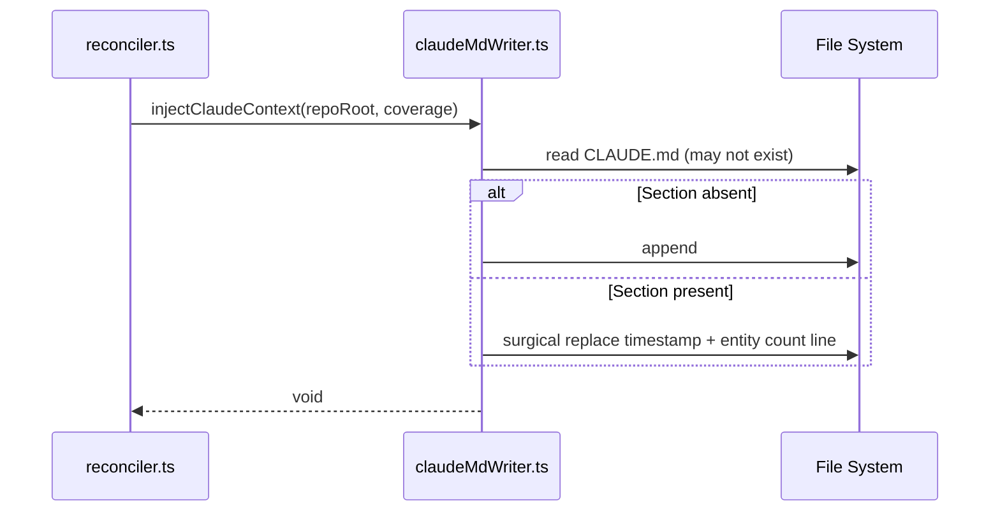

# Feature #7: Claude Code Integration — CLAUDE.md Injection, Plugin Format, and MCP Bridge

> **Legion VS Code Extension** — Feature PRD #007
>
> **Status:** Draft
> **Priority:** P1
> **Effort:** M (3-8h)
> **Schema changes:** None

---

## Phase Overview

### Goals

Legion's documentation engine generates a rich, structured wiki in `library/knowledge-base/wiki/`. Today, that wiki is natively consumed by Cursor (via `.cursor/rules/wiki-hot-context.md`) but is invisible to other agentic tools operating on the same codebase. Anthropic's Claude Code CLI is increasingly used by teams that also use Cursor — often by the same developer in the same repository. This PRD defines three integration layers that make Legion's wiki available to Claude Code with zero additional tooling cost.

Layer 1 (CLAUDE.md injection) delivers immediate value by writing structured routing instructions into the CLAUDE.md file that Claude Code auto-loads at session start. Layer 2 (.claude-plugin/ template) enables custom slash-commands inside Claude Code that invoke Legion's CLI modes directly. Layer 3 (MCP bridge) exposes Legion's entity graph over the MCP protocol that Claude Code supports natively, building on the MCP server defined in feature-002.

### Scope

- **Layer 1:** A new setting `legion.injectClaudeContext` (boolean, default `true`). After each reconcile pass, the reconciler writes or updates a `## Legion Wiki` section in `CLAUDE.md` at the repo root. If `CLAUDE.md` already exists without that section, it is appended non-destructively. The section contains routing instructions pointing Claude Code to `library/knowledge-base/wiki/hot.md`, `index.md`, and `entities/`.
- **Layer 2:** When Initialize runs with wiki-guardian selected, it ships a `.claude-plugin/` directory into the target repo. The directory contains a `plugin.json` manifest and a `commands/` folder with three slash-command definitions. Bundled template lives at `bundled/templates/claude-plugin/`.
- **Layer 3:** Setup instructions appended to the Initialize summary that show the `claude mcp add-json` command referencing the MCP server endpoint defined in feature-002. No new code is written in this layer; the value is documentation and discoverability.

### Out of scope

- The MCP server implementation itself — that is feature-002.
- Claude Code plugin API beyond the `.claude-plugin/` folder convention (Anthropic may evolve this format; we target the stable `plugin.json` schema documented at the time of this PRD).
- Custom Claude Code tools that call VS Code internal APIs.
- Any Anthropic-managed cloud sync of CLAUDE.md files.

### Dependencies

- **Blocks:** None directly. Layer 3 instructions reference feature-002.
- **Blocked by:** feature-002 (MCP server) for Layer 3 to be fully operational.
- **External:** Claude Code CLI ≥ 1.x, CLAUDE.md auto-load behaviour (stable since claude-1.0-tools). `.claude-plugin/` specification documented at https://docs.anthropic.com/claude-code/plugins.

---

## Problem Statement

When a developer switches from Cursor to Claude Code mid-session on the same repository, they lose all the codebase context that Legion's wiki provides. Claude Code does not know about `library/knowledge-base/wiki/`, does not receive `wiki-hot-context.md` (which is Cursor-specific), and has no Legion slash-commands. The result is that Claude Code produces lower-quality answers, re-derives entity relationships Legion already knows, and occasionally contradicts the canonical wiki.

This is correctable at three layers — file-protocol (CLAUDE.md), CLI plugin (slash commands), and MCP — each adding more capability at the cost of more setup.

---

## Goals

1. A developer opening Claude Code in a Legion-enabled repo gets basic wiki routing with no manual setup (Layer 1).
2. A developer who wants richer integration can invoke `/legion-document`, `/legion-research`, and `/legion-find` as first-class slash-commands without leaving Claude Code (Layer 2).
3. A developer who has also initialized the MCP server gets full entity-graph access inside Claude Code with natural language queries (Layer 3).
4. All three layers are opt-in and additive — they do not break existing Cursor or Legion behaviour.

## Non-Goals

- Merging Legion's wiki-guardian logic into Claude Code agents.
- Providing a two-way sync where Claude Code edits are reflected back into the wiki automatically.
- Supporting Claude Code on Windows without WSL (Layer 2 and 3 rely on `node` in PATH).

---

## User Stories

### US-7.1 — Automatic context injection into Claude Code

**As a** developer using both Cursor and Claude Code on a Legion-enabled repository, **I want** `CLAUDE.md` to be automatically maintained with Legion wiki routing instructions, **so that** Claude Code knows where to look for codebase context without any manual configuration.

**Acceptance criteria:**
- AC-7.1.1 Given `legion.injectClaudeContext` is `true` (default), when a reconcile pass completes, then `CLAUDE.md` at the repo root contains a `## Legion Wiki` section with the correct routing instructions and a `Last updated:` timestamp.
- AC-7.1.2 Given `CLAUDE.md` already exists without a `## Legion Wiki` section, when reconcile runs, then the section is appended at the end without modifying existing content.
- AC-7.1.3 Given `CLAUDE.md` already contains a `## Legion Wiki` section, when reconcile runs again, then only the `Last updated:` timestamp and entity count are updated; all other content is preserved.
- AC-7.1.4 Given `legion.injectClaudeContext` is `false`, when reconcile runs, then `CLAUDE.md` is not touched.
- AC-7.1.5 Given the `## Legion Wiki` section already exists with custom user additions below the standard block, when reconcile runs, then those custom additions are preserved.

### US-7.2 — Legion slash-commands inside Claude Code

**As a** developer using Claude Code, **I want** to invoke `/legion-document`, `/legion-research`, and `/legion-find` as slash-commands, **so that** I can trigger Legion operations without switching to VS Code or a separate terminal.

**Acceptance criteria:**
- AC-7.2.1 Given `.claude-plugin/` is present in the repo root, when I open Claude Code, then `/legion-document`, `/legion-research [topic]`, and `/legion-find [query]` appear in the slash-command menu.
- AC-7.2.2 Given I run `/legion-document`, then Claude Code executes `node dist/cli.js --mode document --repo-root .` and streams output to the session.
- AC-7.2.3 Given I run `/legion-research deployment-pipeline`, then the CLI runs with `--mode autoresearch --topic deployment-pipeline`.
- AC-7.2.4 Given the `dist/cli.js` file does not exist (extension not compiled), then the command outputs a user-friendly error message: "Legion CLI not found. Run the 'Legion: Build CLI' command in VS Code first."

### US-7.3 — One-command MCP setup for Claude Code

**As a** developer who has initialized Legion's MCP server, **I want** Initialize to print the exact `claude mcp add-json` command, **so that** I can connect Claude Code to Legion's tool graph in under 30 seconds.

**Acceptance criteria:**
- AC-7.3.1 Given Initialize completes with wiki-guardian selected and feature-002's MCP server is present, then the summary includes a "Claude Code MCP setup" block with the exact `claude mcp add-json legion '{"type":"stdio",...}'` command.
- AC-7.3.2 Given the `claude` CLI is not found in PATH, then the summary note says "Claude Code not detected" rather than showing the setup command.
- AC-7.3.3 Given the user copies and runs the printed command, then `claude mcp list` includes `legion` as a registered server.

---

## Technical Design

### Layer 1 — CLAUDE.md injection

#### Architecture



#### `src/context/claudeMdWriter.ts`

```typescript
import * as fs from "fs/promises";
import * as path from "path";

const SECTION_HEADER = "## Legion Wiki";
const SECTION_FENCE_START = "<!-- legion-wiki-start -->";
const SECTION_FENCE_END = "<!-- legion-wiki-end -->";

export async function injectClaudeContext(
  repoRoot: string,
  entityCount: number,
  wikiPath: string = "library/knowledge-base/wiki"
): Promise<void> {
  const claudeMdPath = path.join(repoRoot, "CLAUDE.md");
  const block = buildLegionBlock(entityCount, wikiPath);

  let existing = "";
  try {
    existing = await fs.readFile(claudeMdPath, "utf8");
  } catch {
    // File does not exist — create it with just the block
    await fs.writeFile(claudeMdPath, block, "utf8");
    return;
  }

  if (existing.includes(SECTION_FENCE_START)) {
    // Surgical replace between fences
    const updated = existing.replace(
      new RegExp(`${SECTION_FENCE_START}[\\s\\S]*?${SECTION_FENCE_END}`),
      block.slice(block.indexOf(SECTION_FENCE_START))
    );
    await fs.writeFile(claudeMdPath, updated, "utf8");
  } else {
    // Append non-destructively
    const separator = existing.endsWith("\n") ? "\n" : "\n\n";
    await fs.writeFile(claudeMdPath, existing + separator + block, "utf8");
  }
}

function buildLegionBlock(entityCount: number, wikiPath: string): string {
  const date = new Date().toISOString().slice(0, 10);
  return `${SECTION_FENCE_START}
${SECTION_HEADER}
Last updated: ${date}. Entities: ${entityCount}. Path: ${wikiPath}/

When you need codebase context, use this lookup order:
1. Read \`${wikiPath}/hot.md\` first — recent high-signal entities (~500 words).
2. Read \`${wikiPath}/index.md\` for the full entity catalog (name, type, file:line).
3. Drill into \`${wikiPath}/entities/<EntityName>.md\` for full spec, changelog, and backlinks.
4. Check \`${wikiPath}/adrs/\` for architecture decisions affecting the relevant domain.

Do NOT read the wiki for general coding questions unrelated to this codebase.
${SECTION_FENCE_END}
`;
}
```

#### Integration point in `reconciler.ts`

After Step 14 (coverage update), add Step 15:

```typescript
// Step 15 — Claude context injection
const config = workspace.getConfiguration("legion");
if (config.get<boolean>("injectClaudeContext", true)) {
  await injectClaudeContext(repoRoot, coverage.total, WIKI_PATH);
}
```

#### Setting registration in `package.json`

```json
"legion.injectClaudeContext": {
  "type": "boolean",
  "default": true,
  "description": "Automatically maintain a ## Legion Wiki section in CLAUDE.md at the repository root after each reconcile pass. Claude Code auto-loads this file at session start."
}
```

---

### Layer 2 — `.claude-plugin/` template

#### Plugin manifest structure

```
.claude-plugin/
├── plugin.json          ← manifest
└── commands/
    ├── legion-document.md
    ├── legion-research.md
    └── legion-find.md
```

#### `plugin.json`

```json
{
  "name": "legion",
  "displayName": "Legion Wiki Guardian",
  "description": "Run Legion documentation operations directly from Claude Code. Requires the Legion VS Code extension to be installed and the CLI to be compiled (dist/cli.js).",
  "version": "1.0.0",
  "author": "Legion Project",
  "homepage": "https://github.com/your-org/vibecode-legion",
  "skills": [
    "commands/legion-document.md",
    "commands/legion-research.md",
    "commands/legion-find.md"
  ]
}
```

#### `commands/legion-document.md`

```markdown
# /legion-document

Trigger a Legion wiki scan and documentation pass on the current repository.
Equivalent to clicking "Document" in the Legion VS Code sidebar.

## Usage

/legion-document

## Implementation

Run the following shell command from the repository root:

\`\`\`bash
node dist/cli.js --mode document --repo-root .
\`\`\`

If dist/cli.js is not found, inform the user:
"Legion CLI not found. Open VS Code, run 'Legion: Build CLI', then retry."

Stream all stdout output to the conversation. On non-zero exit code, show stderr
and suggest checking the Legion Output channel in VS Code.
```

#### `commands/legion-research.md`

```markdown
# /legion-research [topic]

Run Legion's auto-research mode for a given topic. Legion will gather context
from the wiki, the codebase, and recent commit messages, then synthesize a
structured research summary.

## Usage

/legion-research <topic>

Example: /legion-research authentication-flow

## Implementation

\`\`\`bash
node dist/cli.js --mode autoresearch --topic "<topic>" --repo-root .
\`\`\`

The [topic] argument is required. If omitted, ask the user for a topic before
running.
```

#### `commands/legion-find.md`

```markdown
# /legion-find [query]

Search the Legion wiki for entities matching the query string. Returns a ranked
list of wiki pages with file:line references.

## Usage

/legion-find <query>

Example: /legion-find reconciler

## Implementation

\`\`\`bash
node dist/cli.js --mode find --query "<query>" --repo-root .
\`\`\`

The [query] argument is required. Display the results in a bulleted list with
links to the wiki pages and source file references.
```

#### Bundled template location

```
bundled/
└── templates/
    └── claude-plugin/
        ├── plugin.json
        └── commands/
            ├── legion-document.md
            ├── legion-research.md
            └── legion-find.md
```

#### Initialize copy logic (in `initializer.ts`)

```typescript
async function copyClaudePluginTemplate(repoRoot: string): Promise<void> {
  const src = path.join(__dirname, "../../bundled/templates/claude-plugin");
  const dest = path.join(repoRoot, ".claude-plugin");

  if (await pathExists(dest)) {
    log.info(".claude-plugin already exists — skipping copy");
    return;
  }

  await copyDir(src, dest);
  log.info("Copied .claude-plugin/ template to repo root");
}
```

Called from `runInitialize()` when `wiki-guardian` is among the selected guardians:

```typescript
if (selectedGuardians.includes("wiki-guardian")) {
  await copyClaudePluginTemplate(repoRoot);
  await copyCursorRulesTemplate(repoRoot); // existing
}
```

---

### Layer 3 — MCP bridge summary in Initialize

```typescript
function buildMcpSetupNote(repoRoot: string): string {
  const serverJson = JSON.stringify({
    type: "stdio",
    command: "node",
    args: [path.join(repoRoot, "dist/mcp-server.js")],
    env: { LEGION_REPO_ROOT: repoRoot },
  });

  return `
## Claude Code MCP Setup (Optional — requires feature-002 MCP server)

Run the following command once to register Legion's tool graph with Claude Code:

\`\`\`bash
claude mcp add-json legion '${serverJson}'
\`\`\`

After registration, \`claude mcp list\` should include \`legion\`.
Available tools: legion_get_context, legion_find_entity, legion_get_entity,
legion_list_contradictions, legion_get_adr.
`;
}
```

---

## Implementation Plan

### Phase 1 — Layer 1: CLAUDE.md injection (Day 1, ~2h)

1. Create `src/context/claudeMdWriter.ts` with `injectClaudeContext()` and `buildLegionBlock()`.
2. Add unit tests in `src/context/claudeMdWriter.spec.ts` covering: new file creation, append to existing, surgical timestamp update, setting disabled (no write).
3. Register `legion.injectClaudeContext` setting in `package.json`.
4. Call `injectClaudeContext` from `reconciler.ts` after Step 14.
5. Add `CLAUDE.md` to `.gitignore` recommendation in Initialize summary (optional section).

### Phase 2 — Layer 2: .claude-plugin/ template (Day 1–2, ~2h)

1. Create `bundled/templates/claude-plugin/` with the three files above.
2. Add `copyClaudePluginTemplate()` to `initializer.ts`.
3. Wire into `runInitialize()` guard for wiki-guardian selection.
4. Add integration test: run Initialize with wiki-guardian, verify `.claude-plugin/` is created with correct contents.
5. Add a `.claude-plugin/` entry to the Initialize summary output.

### Phase 3 — Layer 3: MCP setup note (Day 2, ~1h)

1. Implement `buildMcpSetupNote()` in `initializer.ts`.
2. Detect `claude` CLI in PATH using `which claude` / `where claude`.
3. Conditionally append MCP setup note to Initialize summary when: (a) wiki-guardian selected, (b) feature-002 MCP server file exists at `dist/mcp-server.js`, (c) `claude` is in PATH.
4. Add unit test for the conditional logic.

---

## Data Model Changes

None. This feature writes to the file system only.

---

## API / Endpoint Specs

No HTTP APIs. The CLI modes invoked by the slash-commands are:

| Mode | Flag | Description |
|---|---|---|
| `document` | `--mode document --repo-root <path>` | Full reconcile pass |
| `autoresearch` | `--mode autoresearch --topic <topic> --repo-root <path>` | Research synthesis |
| `find` | `--mode find --query <query> --repo-root <path>` | Entity search |

All modes exit 0 on success, non-zero on error, and write structured JSON to stdout with human-readable summary lines to stderr.

---

## Files Touched

### New files
- `src/context/claudeMdWriter.ts` — CLAUDE.md read/write logic
- `src/context/claudeMdWriter.spec.ts` — unit tests
- `bundled/templates/claude-plugin/plugin.json` — plugin manifest
- `bundled/templates/claude-plugin/commands/legion-document.md`
- `bundled/templates/claude-plugin/commands/legion-research.md`
- `bundled/templates/claude-plugin/commands/legion-find.md`

### Modified files
- `src/reconciler.ts` — call `injectClaudeContext` in Step 15
- `src/initializer.ts` — `copyClaudePluginTemplate()`, `buildMcpSetupNote()`
- `package.json` — register `legion.injectClaudeContext` setting
- `src/initializer.spec.ts` — integration test for .claude-plugin/ copy

---

## Success Metrics

| Metric | Target |
|---|---|
| Reconcile overhead from CLAUDE.md write | < 20ms per pass |
| Time from Initialize to Claude Code wiki-aware session | < 60 seconds (Layer 1 only) |
| Unit test coverage for `claudeMdWriter.ts` | 100% branch coverage |
| CLAUDE.md correctness after 3 sequential reconcile passes | No content duplication, timestamp updated |

---

## Open Questions

1. **CLAUDE.md in .gitignore?** Claude Code recommends committing CLAUDE.md. Legion-injected content is auto-generated. Should we commit it or add it to `.gitignore`? Current recommendation: commit it, since the routing instructions are stable and useful to the team. The timestamp churn is acceptable.
2. **`.claude-plugin/` API stability:** Anthropic has not published a formal stability guarantee for the `.claude-plugin/` spec. If the format changes, the bundled template needs updating. We track this with a Dependabot-equivalent manual review cadence.
3. **Windows support for Layer 2:** The slash-commands shell `node dist/cli.js`. On Windows without WSL, `node` path resolution may differ. Should we emit `node.cmd` on Windows? Investigate before Phase 2 ship.
4. **Entity count accuracy:** `injectClaudeContext` receives `coverage.total`. Should we break this down by type (entities, concepts, decisions) for richer context in the CLAUDE.md block?

---

## Risks and Open Questions

- **Risk:** Anthropic changes the `.claude-plugin/` format in a breaking way. **Mitigation:** Abstract the template copy behind a versioned manifest check; add a warning if the installed Claude Code version is below the minimum tested version.
- **Risk:** CLAUDE.md content grows too large for Claude Code's context window. **Mitigation:** The Legion block is capped at ~20 lines. It describes where to look, not the content itself.
- **Risk:** Multiple tools (Legion + other plugins) all write to CLAUDE.md. **Mitigation:** Fence markers (`<!-- legion-wiki-start -->`) ensure surgical, non-conflicting writes regardless of file order.

---

## Related

- [`feature-002-mcp-server/prd-feature-002-mcp-server.md`](../feature-002-mcp-server/prd-feature-002-mcp-server.md) — MCP server that Layer 3 references.
- [`feature-001-initialize/prd-feature-001-initialize.md`](../feature-001-initialize/prd-feature-001-initialize.md) — Initialize command that Layer 2 extends.
- [`knowledge-base/wiki/entities/reconciler.md`](../../../knowledge-base/wiki/entities/reconciler.md) — reconciler entity where Step 15 is added.
