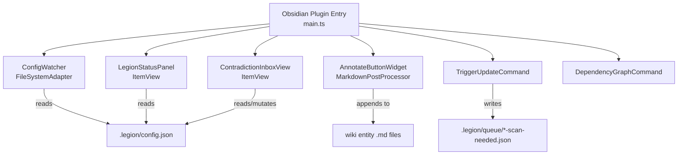

# Feature #8: Obsidian Companion Plugin — Non-developer Wiki Access and Human Annotations

> **Legion VS Code Extension** — Feature PRD #008
>
> **Status:** Draft
> **Priority:** P2
> **Effort:** L (8-24h)
> **Schema changes:** None (Obsidian plugin; reads Legion file protocol only)

---

## Phase Overview

### Goals

Legion's wiki lives in `library/knowledge-base/wiki/` as standard Markdown files with YAML frontmatter and `[[wikilinks]]`. Obsidian can already open this folder as a vault — the wikilinks render, the graph view works, and files are searchable. What Obsidian does not have is any awareness of Legion's operational state: whether the wiki has been initialized, when it was last scanned, how many contradictions are unresolved, and how healthy coverage is.

This PRD defines a native Obsidian plugin (separate TypeScript project, separate GitHub repo) that:

1. Shows Legion's operational state in a sidebar panel (status, entity count, last scan date, contradiction inbox).
2. Provides a contradiction inbox view where a non-developer can mark contradictions resolved or view the conflicting pages side-by-side.
3. Lets any team member trigger a Legion update pass without needing VS Code open — by dropping a queue marker file that the VS Code extension picks up.
4. Enables human annotations on any wiki entity page that Legion's wiki-guardian will never overwrite.
5. Applies color-coding and graph filtering to make the wiki structure immediately navigable.

The result is a first-class documentation portal for non-developer stakeholders — product managers, technical writers, designers — who want to read and annotate the wiki without touching VS Code.

### Scope

- Standalone TypeScript Obsidian plugin using the Obsidian Plugin API (not VS Code).
- Status sidebar panel with real-time state from `.legion/config.json`.
- Contradiction inbox view: list, mark-resolved, open-diff.
- Trigger Update: ribbon icon / command palette drops `.legion/queue/<timestamp>-scan-needed.json`.
- Human annotations: "Annotate" button appends `## Human Notes` section; wiki-guardian skill update marks this section sacred.
- Color-coded file explorer via `.obsidian/snippets/legion-vault-colors.css`.
- Graph view "Show entity dependency graph" command.
- Distribution via Obsidian community plugin registry.

### Out of scope

- Document / Update / Lint operations — those remain in the VS Code extension.
- Direct VS Code API calls from the Obsidian plugin.
- Writing back to wiki entity files except for the `## Human Notes` section.
- Real-time bidirectional sync (the trigger-update pattern is fire-and-forget via queue file).

### Dependencies

- **Blocks:** None.
- **Blocked by:** The target repo must have Legion initialized (`.legion/config.json` and `library/knowledge-base/wiki/` must exist).
- **External:** Obsidian Plugin API (stable, versioned by Obsidian minimum app version); Obsidian community registry review process (manual, 1-4 weeks).

---

## Problem Statement

Non-developer team members who want to consult the Legion wiki face a friction wall: they must either install VS Code (unfamiliar) or use GitHub's web UI (no wikilink rendering, no graph view). Obsidian is a well-known tool among technical writers, product managers, and designers. The existing Obsidian compatibility of Legion's wiki format is a structural advantage that is currently wasted — there is no plugin to surface Legion's operational state or enable meaningful contribution.

The contradiction inbox problem is particularly acute: contradictions are detected by wiki-guardian but are only surfaced in the VS Code sidebar. A technical writer who is the most qualified person to resolve a documentation contradiction cannot act on it without VS Code access.

---

## Goals

1. A non-developer can open the Legion wiki vault in Obsidian and immediately see health status, entity count, and contradiction count.
2. A technical writer can read a contradiction, compare the two conflicting pages, and mark it resolved — without VS Code.
3. Any team member can trigger a Legion update pass from Obsidian; the VS Code extension picks it up on next activation.
4. Human annotations added via Obsidian's "Annotate" button are preserved across all future Legion scans.
5. The wiki is color-coded by entity type in the file explorer and filterable by dependency edges in the graph view.

## Non-Goals

- Running wiki-guardian agent logic inside Obsidian.
- Providing a two-way real-time sync channel (WebSocket, LSP, etc.) between Obsidian and VS Code.
- Authoring new wiki entity pages from Obsidian (read + annotate only in v1).
- Mobile Obsidian support (desktop only in v1).

---

## User Stories

### US-8.1 — View Legion operational status in Obsidian

**As a** technical writer opening the wiki vault in Obsidian, **I want** a sidebar panel showing Legion's current state, **so that** I know whether the wiki is up to date before I start reading.

**Acceptance criteria:**
- AC-8.1.1 Given `.legion/config.json` exists and is valid, when the plugin loads, then the "Legion Status" panel shows: initialized status, last scan date, entity count, and contradiction inbox count.
- AC-8.1.2 Given any of those fields change in `.legion/config.json`, when the file is saved, then the panel updates within 2 seconds (file change watch).
- AC-8.1.3 Given `.legion/config.json` does not exist, when the plugin loads, then the panel shows "Legion not initialized in this vault" and a link to the Legion VS Code extension marketplace page.

### US-8.2 — Resolve contradictions from Obsidian

**As a** technical writer, **I want** to view and resolve documentation contradictions without opening VS Code, **so that** I can contribute to wiki quality using the tool I already use.

**Acceptance criteria:**
- AC-8.2.1 Given the contradiction inbox count is > 0, when I click the inbox count in the status panel, then the "Contradiction Inbox" leaf view opens listing all unresolved contradictions.
- AC-8.2.2 Given a contradiction is listed, when I click "Open diff", then both conflicting wiki pages open side-by-side in Obsidian's split view.
- AC-8.2.3 Given I click "Mark resolved" on a contradiction, then the contradiction is removed from `.legion/config.json`'s contradiction array and the inbox count decrements.
- AC-8.2.4 Given the "Mark resolved" action mutates `.legion/config.json`, then a backup `.legion/config.json.bak` is written before each mutation (overwritten each time — single backup slot).

### US-8.3 — Trigger a Legion update pass from Obsidian

**As a** technical writer who has made structural changes (renamed a file, updated content), **I want** to request a Legion scan without opening VS Code, **so that** the wiki reflects my changes quickly.

**Acceptance criteria:**
- AC-8.3.1 Given I click the "Trigger Update" ribbon icon or run "Legion: Trigger Update" from the command palette, then a file is created at `.legion/queue/<ISO-timestamp>-scan-needed.json` with payload `{"source":"obsidian","triggeredAt":"<ISO-timestamp>"}`.
- AC-8.3.2 Given VS Code with the Legion extension is already open and watching the queue directory, then it picks up the marker file and runs a reconcile pass (this pickup is implemented in the VS Code extension, not the Obsidian plugin).
- AC-8.3.3 Given VS Code is not open, when I trigger the update, then the marker file remains in the queue directory until VS Code next starts.

### US-8.4 — Add human annotations to wiki entity pages

**As a** technical writer reading a wiki entity page, **I want** to add notes that survive future Legion scans, **so that** I can annotate entities with domain knowledge that code analysis cannot infer.

**Acceptance criteria:**
- AC-8.4.1 Given I am in reading view for any file under `library/knowledge-base/wiki/`, when I click the "Annotate" button in the action bar, then a `## Human Notes` section is appended to the file if it does not already exist, and the file opens in editing mode with the cursor at the start of that section.
- AC-8.4.2 Given a file already has a `## Human Notes` section, when I click "Annotate", then the file opens in editing mode at the existing section without duplicating it.
- AC-8.4.3 Given the `## Human Notes` section exists in a wiki entity file, when wiki-guardian subsequently scans and updates the entity, then the `## Human Notes` section is left unchanged (enforced by wiki-guardian skill update in feature-012 or an adjacent wiki-weapon update).

### US-8.5 — Color-coded file explorer by entity type

**As a** developer or technical writer navigating the wiki in Obsidian, **I want** entity files to be color-coded by type in the file explorer, **so that** I can instantly distinguish entities from concepts, decisions, and questions.

**Acceptance criteria:**
- AC-8.5.1 Given the plugin is enabled, then `.obsidian/snippets/legion-vault-colors.css` is written to the vault root with the canonical color scheme (entities: blue, concepts: green, decisions: purple, questions: orange).
- AC-8.5.2 Given the CSS snippet is present, when I enable it in Obsidian → Appearance → CSS Snippets, then files in `entities/` appear blue, `concepts/` green, `adrs/` purple, and `questions/` orange in the file explorer.
- AC-8.5.3 The CSS snippet is written once on plugin install; subsequent plugin loads do not overwrite it (so user edits to the CSS are preserved).

### US-8.6 — Filter graph view to entity dependency edges

**As a** architect reviewing the wiki, **I want** to see only the `depends_on` edges between entities in the graph view, **so that** I can reason about the system's dependency topology without noise.

**Acceptance criteria:**
- AC-8.6.1 Given I run "Legion: Show entity dependency graph" from the command palette, then Obsidian opens the graph view with a filter pre-applied that shows only files under `entities/` that have `depends_on` links to other `entities/` files.
- AC-8.6.2 The filter applied is a standard Obsidian graph view local filter (not a custom renderer), so it is persistent once applied.

---

## Technical Design

### Plugin architecture



### `.legion/config.json` schema (Legion-side, read by plugin)

```typescript
interface LegionConfig {
  initialized: boolean;
  lastScanDate: string;        // ISO-8601
  entityCount: number;
  wikiPath: string;            // relative, e.g. "library/knowledge-base/wiki"
  contradictions: Contradiction[];
  coveragePct: number;
}

interface Contradiction {
  id: string;
  pageA: string;              // relative path
  pageB: string;              // relative path
  description: string;
  detectedAt: string;         // ISO-8601
  resolved: boolean;
}
```

### Queue file schema (written by plugin, read by VS Code extension)

```typescript
interface ScanNeededMarker {
  source: "obsidian" | "post-commit-hook" | "manual";
  triggeredAt: string;  // ISO-8601
}
```

### Status panel (`src/views/LegionStatusPanel.ts`)

```typescript
import { ItemView, WorkspaceLeaf, TFile } from "obsidian";

export const LEGION_STATUS_VIEW = "legion-status";

export class LegionStatusPanel extends ItemView {
  private config: LegionConfig | null = null;

  getViewType() { return LEGION_STATUS_VIEW; }
  getDisplayText() { return "Legion Status"; }

  async onOpen() {
    await this.refresh();
    this.registerEvent(
      this.app.vault.on("modify", (file: TFile) => {
        if (file.path === ".legion/config.json") this.refresh();
      })
    );
  }

  async refresh() {
    try {
      const raw = await this.app.vault.adapter.read(".legion/config.json");
      this.config = JSON.parse(raw);
    } catch {
      this.config = null;
    }
    this.render();
  }

  render() {
    const container = this.containerEl.children[1];
    container.empty();

    if (!this.config) {
      container.createEl("p", {
        text: "Legion not initialized in this vault.",
        cls: "legion-not-initialized",
      });
      container.createEl("a", {
        text: "Install the Legion VS Code Extension",
        href: "https://marketplace.visualstudio.com/items?itemName=legion",
      });
      return;
    }

    const { initialized, lastScanDate, entityCount, contradictions, coveragePct } = this.config;
    const unresolvedCount = contradictions.filter(c => !c.resolved).length;

    container.createEl("h4", { text: "Legion Wiki Status" });
    this.row(container, "Initialized", initialized ? "✓" : "✗");
    this.row(container, "Last scan", lastScanDate.slice(0, 10));
    this.row(container, "Entities", String(entityCount));
    this.row(container, "Coverage", `${coveragePct}%`);

    const inboxRow = this.row(container, "Contradictions", String(unresolvedCount));
    if (unresolvedCount > 0) {
      inboxRow.addClass("legion-has-contradictions");
      inboxRow.addEventListener("click", () => {
        this.app.workspace.getLeaf("split").setViewState({
          type: LEGION_CONTRADICTION_VIEW,
        });
      });
    }
  }

  private row(parent: Element, label: string, value: string): HTMLElement {
    const row = parent.createEl("div", { cls: "legion-status-row" });
    row.createEl("span", { text: label, cls: "legion-label" });
    row.createEl("span", { text: value, cls: "legion-value" });
    return row;
  }
}
```

### Trigger Update command

```typescript
async function triggerUpdate(app: App): Promise<void> {
  const queueDir = ".legion/queue";
  const timestamp = new Date().toISOString().replace(/[:.]/g, "-");
  const markerPath = `${queueDir}/${timestamp}-scan-needed.json`;
  const payload: ScanNeededMarker = {
    source: "obsidian",
    triggeredAt: new Date().toISOString(),
  };

  try {
    await app.vault.adapter.mkdir(queueDir);
  } catch { /* already exists */ }

  await app.vault.adapter.write(markerPath, JSON.stringify(payload, null, 2));
  new Notice("Legion update queued. VS Code will pick this up on next activation.");
}
```

### CSS snippet content (`legion-vault-colors.css`)

```css
/* Legion Wiki — entity type color coding */
/* Enable in Obsidian → Appearance → CSS Snippets → legion-vault-colors */

.nav-file-title[data-path*="/entities/"] .nav-file-title-content { color: #5b9bd5; }
.nav-file-title[data-path*="/concepts/"] .nav-file-title-content { color: #4caf82; }
.nav-file-title[data-path*="/adrs/"] .nav-file-title-content     { color: #9c6fbc; }
.nav-file-title[data-path*="/questions/"] .nav-file-title-content { color: #e8a23d; }

.nav-file-title[data-path*="/entities/"]:hover .nav-file-title-content { color: #7bb8e8; }
.nav-file-title[data-path*="/concepts/"]:hover .nav-file-title-content { color: #66c79a; }
.nav-file-title[data-path*="/adrs/"]:hover .nav-file-title-content     { color: #b487d3; }
.nav-file-title[data-path*="/questions/"]:hover .nav-file-title-content { color: #f0bb65; }
```

---

## Implementation Plan

### Phase 1 — Project scaffold and Status panel (Week 1, ~6h)

1. Create new repo `legion-obsidian` from Obsidian sample plugin template.
2. Configure TypeScript strict mode, ESLint, esbuild bundler.
3. Implement `LegionStatusPanel` (ItemView + file watcher).
4. Implement `LegionConfigWatcher` that debounces reads on `modify` events.
5. Register view and ribbon icon in `main.ts`.
6. Populate `.obsidian/snippets/legion-vault-colors.css` on plugin load (once-only guard).
7. Manual QA: open test vault with `.legion/config.json`, verify panel renders correctly.

### Phase 2 — Contradiction inbox (Week 1–2, ~4h)

1. Implement `ContradictionInboxView` (ItemView listing unresolved contradictions).
2. Implement "Open diff" — `app.workspace.getLeaf("split").openFile(fileA)` + same for fileB.
3. Implement "Mark resolved" — JSON parse/mutate/write `.legion/config.json` with `.bak` pre-write.
4. Wire inbox count click from status panel to open contradiction view.
5. Add error handling for JSON parse failures (show error notice, offer to open raw file).

### Phase 3 — Trigger Update and Human Annotations (Week 2, ~4h)

1. Implement `triggerUpdate()` command and register as command palette entry + ribbon icon variant.
2. Implement `AnnotateButtonWidget` as a MarkdownPostProcessor that only activates for files matching `library/knowledge-base/wiki/**/*.md`.
3. Append `## Human Notes\n\n` if absent, then open file for editing.
4. Update `wiki-weapon` skill: add instruction that `## Human Notes` sections are sacred and must not be overwritten during entity updates.

### Phase 4 — Graph view command and distribution (Week 2–3, ~4h)

1. Implement "Legion: Show entity dependency graph" command using Obsidian's `openGraph` API with pre-built filter query.
2. Configure `manifest.json` with correct `minAppVersion`, `isDesktopOnly: true`.
3. Submit to Obsidian community plugin registry (BRAT first for beta testing).
4. Set up GitHub Actions CI: lint + build on push, release to GitHub releases on tag.
5. Tag paired versioning convention: `obsidian-plugin@1.0.0` paired with `legion@1.x`.

---

## Data Model Changes

None. The plugin reads and surgically edits `.legion/config.json` (contradiction resolution). It does not define new schemas; it reads the schema defined by the VS Code extension.

---

## Files Touched (in `legion-obsidian` repo)

### New files
- `src/main.ts` — plugin entry, command registration, lifecycle
- `src/views/LegionStatusPanel.ts` — ItemView for status sidebar
- `src/views/ContradictionInboxView.ts` — ItemView for contradiction list
- `src/widgets/AnnotateButton.ts` — MarkdownPostProcessor
- `src/commands/triggerUpdate.ts` — queue file writer
- `src/commands/dependencyGraph.ts` — graph view filter command
- `src/utils/configReader.ts` — `.legion/config.json` read/parse/write
- `assets/legion-vault-colors.css` — snapshot of the CSS to write on install
- `manifest.json` — Obsidian plugin manifest

### Modified files (in main Legion repo)

- `.cursor/skills/wiki-weapon/guides/` — add instruction about `## Human Notes` section sanctity

---

## Success Metrics

| Metric | Target |
|---|---|
| Status panel load time from vault open | < 500ms |
| Config.json reload latency after file change | < 2s |
| Contradiction mark-resolved round-trip (write + UI update) | < 1s |
| CSS snippet write (first install) | < 100ms |
| Obsidian community plugin registry review SLA | Target submission within 2 weeks of Phase 4 completion |

---

## Open Questions

1. **Vault root assumption:** the plugin assumes the vault root contains `.legion/`. What if the user opens only the `library/` subfolder as a vault? Should we walk parent directories looking for `.legion/`?
2. **`## Human Notes` conflict:** if wiki-guardian currently rewrites entity files top-to-bottom, what is the minimal change to make it stop before the `## Human Notes` heading? The wiki-weapon skill update in Phase 3 handles the instruction layer, but the implementation in wiki-guardian's reconciler also needs a code change. Track this as a dependency.
3. **Obsidian mobile:** the plugin sets `isDesktopOnly: true`. Is there a path to mobile support where queue files can be written via iCloud/OneDrive sync? Deferred to v2.
4. **Back-compat with older `.legion/config.json` schemas:** the plugin should gracefully handle missing fields (e.g., `coveragePct` may not exist in older versions).

---

## Risks and Open Questions

- **Risk:** Obsidian Plugin API breaks on major Obsidian updates. **Mitigation:** Pin `minAppVersion`, test on each Obsidian release via BRAT beta channel, set up a GitHub Actions matrix test against multiple Obsidian versions.
- **Risk:** `.legion/config.json` corruption if VS Code and Obsidian both write simultaneously. **Mitigation:** The plugin only writes during "Mark resolved" (low-frequency user action). Implement a file lock check: if the file was modified within the last 500ms, abort the write and show a retry notice.
- **Risk:** Obsidian community plugin review rejection (security review can reject plugins that write outside the vault). **Mitigation:** All writes are inside the vault root (`.legion/` and `.obsidian/`). Document this in the plugin's `README.md` for reviewers.

---

## Related

- [`feature-007-claude-code-integration/prd-feature-007-claude-code-integration.md`](../feature-007-claude-code-integration/prd-feature-007-claude-code-integration.md) — parallel third-party IDE integration pattern.
- [`feature-011-jetbrains-plugin/prd-feature-011-jetbrains-plugin.md`](../feature-011-jetbrains-plugin/prd-feature-011-jetbrains-plugin.md) — same trigger-update file protocol used for JetBrains.
- [`knowledge-base/wiki/entities/config-json.md`](../../../knowledge-base/wiki/entities/config-json.md) — canonical `.legion/config.json` schema reference.
