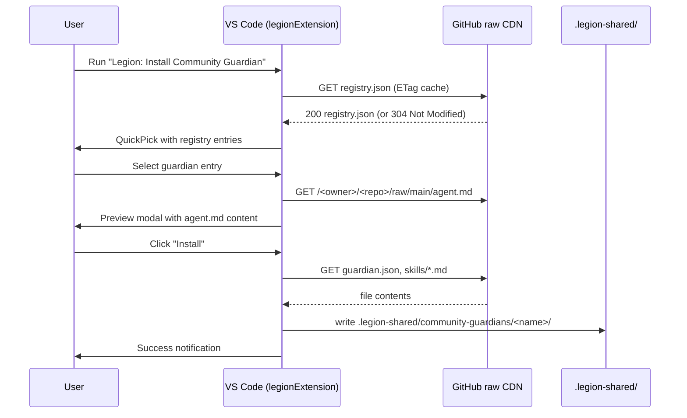

# Feature #9: Community Guardian Plugin Ecosystem

> **Legion VS Code Extension** — Feature PRD #009
>
> **Status:** Draft
> **Priority:** P2
> **Effort:** L (8-24h)
> **Schema changes:** None

---

## Phase Overview

### Goals

Legion ships 14 bundled guardians (wiki-guardian, react-guardian, db-guardian, etc.). Adding a new guardian today requires: forking the repo, modifying `initializer.ts`, adding an agent file to `bundled/agents/`, recompiling the extension, and publishing a new VS Code marketplace release. This is a 24-48 hour cycle with maintainer involvement — a barrier that prevents the community from publishing domain-specific guardians without waiting for official releases.

This PRD defines a community plugin ecosystem: a package format, a registry, an install/update flow, and an official registry repository. The design deliberately keeps community guardians as prompt-and-skill files only, with no code execution capability — the same trust model as Cursor's `.cursor/agents/` directory.

### Scope

- Guardian package format (GitHub repo convention with `guardian.json`, `agent.md`, `skills/`).
- JSON registry hosted at a configurable URL (default: `https://raw.githubusercontent.com/legion-project/legion-guardian-registry/main/registry.json`).
- Install command (`legion.installGuardian`) with QuickPick UI, dry-run preview, and download from raw GitHub.
- Storage in `.legion-shared/community-guardians/<name>/`.
- `discoverGuardians()` extended to scan both `bundled/agents/` and community guardians.
- Update command (`legion.updateGuardians`) that checks installed community guardians against the registry.
- Official registry as a separate GitHub repo (`legion-guardian-registry`) with a PR-based submission process.
- Security model documentation and "View before install" preview UI.

### Out of scope

- Bundled guardian modifications (that is the main extension's concern).
- Paid/private guardian marketplace (all guardians in v1 are open source on GitHub).
- Guardian code execution (guardians are prompt files only — no TypeScript/JavaScript in community packages).
- Guardian versioning pinning per-repository (v1 always installs the latest version).

### Dependencies

- **Blocks:** None.
- **Blocked by:** feature-001 (Initialize), which defines the `discoverGuardians()` API we extend.
- **External:** GitHub raw content CDN (rate-limited; use conditional GETs with ETag caching). Configurable via `legion.guardianRegistryUrl`.

---

## Problem Statement

The Legion guardian architecture is powerful but closed: adding a new guardian requires a maintainer commit and a VS Code marketplace publish cycle. Community members who have built excellent domain-specific guardian prompts (for Next.js App Router, Prisma schemas, testing conventions, etc.) cannot share them without a full fork. The extension's guardian list is also fixed at install time — there is no update path except upgrading the extension.

Meanwhile, Cursor's `.cursor/agents/` convention shows that AI agent prompt files are inherently shareable and low-risk: they contain instructions, not code. A community ecosystem of Legion guardians can follow the same model with a structured discovery and installation experience.

---

## Goals

1. Any developer can publish a Legion guardian by creating a GitHub repo with the package format and submitting a PR to the official registry.
2. Any Legion user can browse, preview, and install community guardians from inside VS Code in under 2 minutes.
3. Installed community guardians are discovered automatically alongside bundled guardians without any manual `settings.json` editing.
4. The install flow shows the user the agent.md content before installation (trust preview).
5. The update command checks installed guardians against the registry and installs newer versions.

## Non-Goals

- Building a paid marketplace or guardian storefront.
- Executing community guardian code (TypeScript, scripts, binaries) — prompts only.
- Supporting private registries in v1 (the `legion.guardianRegistryUrl` setting enables this but it is undocumented in v1).
- GUI for guardian authorship/scaffolding (a future `legion.newGuardian` scaffold command).

---

## User Stories

### US-9.1 — Browse and install a community guardian

**As a** Legion user working on a Next.js project, **I want** to install a `nextjs-guardian` from the community registry, **so that** Legion's documentation passes are aware of Next.js App Router patterns without me writing the guardian prompt myself.

**Acceptance criteria:**
- AC-9.1.1 Given I run `Legion: Install Community Guardian`, then a QuickPick appears listing all guardians in the registry with name, description, author, and version.
- AC-9.1.2 Given I search "next" in the QuickPick, then results are filtered to guardians with "next" in their name, description, or tags.
- AC-9.1.3 Given I select a guardian, then a preview modal shows the full `agent.md` content before any download occurs, with "Install" and "Cancel" buttons.
- AC-9.1.4 Given I click "Install", then the guardian files are downloaded to `.legion-shared/community-guardians/<name>/` and a success notification shows "nextjs-guardian v1.2.0 installed".
- AC-9.1.5 Given the guardian is installed, then it appears in the Initialize guardian selection QuickPick on next run, alongside the bundled guardians.
- AC-9.1.6 Given the download fails (network error, GitHub rate limit), then a descriptive error is shown with the raw GitHub URL for manual download.

### US-9.2 — Update installed community guardians

**As a** Legion user, **I want** to update installed community guardians to their latest versions, **so that** I benefit from community improvements without reinstalling manually.

**Acceptance criteria:**
- AC-9.2.1 Given I run `Legion: Update Community Guardians`, then Legion fetches the registry and compares installed versions against latest versions.
- AC-9.2.2 Given an installed guardian has a newer version available, then a QuickPick appears listing upgradable guardians with `<current> → <latest>` labels.
- AC-9.2.3 Given I select guardians to update, then their files are replaced in `.legion-shared/community-guardians/<name>/`.
- AC-9.2.4 Given all installed guardians are up to date, then a notification says "All community guardians are up to date."
- AC-9.2.5 Given a guardian is pinned (`"pinned": true` in `.legion-shared/community-guardians/<name>/guardian.json`), then it is skipped during updates without prompting.

### US-9.3 — Publish a community guardian

**As a** developer who has written a domain-specific guardian prompt, **I want** to publish it to the Legion community registry, **so that** other Legion users can discover and install it.

**Acceptance criteria:**
- AC-9.3.1 Given I create a GitHub repo with the package format (`guardian.json`, `agent.md`, `skills/`, `LICENSE`), then it conforms to the spec with no additional tooling.
- AC-9.3.2 Given I submit a PR to `legion-guardian-registry` adding my guardian to `registry.json`, then the CI validation workflow validates: `guardian.json` parses, `agent.md` is non-empty, GitHub repo URL is reachable.
- AC-9.3.3 Given the PR is merged, then the guardian is immediately available in the registry and installable by all Legion users without any extension update.

---

## Technical Design

### Guardian package format

A community guardian is a public GitHub repository with the following required structure:

```
<repo-root>/
├── guardian.json     ← required manifest
├── agent.md          ← required: guardian prompt (same format as bundled agents)
├── skills/           ← optional: weapon skill files
│   └── *.md
├── LICENSE           ← required (must be OSI-approved)
└── README.md         ← strongly recommended
```

#### `guardian.json` schema

```typescript
interface GuardianManifest {
  name: string;           // npm-package-name style: lowercase-kebab, no spaces
  displayName: string;    // human-readable: "Next.js App Router Guardian"
  description: string;    // ≤ 120 chars
  version: string;        // semver e.g. "1.0.0"
  minLegionVersion: string; // e.g. "0.5.0" — minimum Legion extension version
  agentFile: string;      // always "agent.md" (relative path)
  skillFiles: string[];   // relative paths under skills/
  author: string;         // display name or GitHub handle
  homepage: string;       // GitHub repo URL
  tags: string[];         // searchable: ["nextjs", "react", "frontend"]
  license: string;        // SPDX identifier e.g. "MIT"
}
```

Example `guardian.json`:

```json
{
  "name": "nextjs-guardian",
  "displayName": "Next.js App Router Guardian",
  "description": "Documents Next.js App Router patterns: server components, route handlers, metadata API, and parallel routes.",
  "version": "1.2.0",
  "minLegionVersion": "0.5.0",
  "agentFile": "agent.md",
  "skillFiles": ["skills/nextjs-weapon.md"],
  "author": "Jane Developer",
  "homepage": "https://github.com/janedeveloper/legion-nextjs-guardian",
  "tags": ["nextjs", "react", "frontend", "app-router"],
  "license": "MIT"
}
```

### Registry format

```typescript
interface GuardianRegistry {
  version: number;        // registry schema version (1)
  updatedAt: string;      // ISO-8601
  guardians: RegistryEntry[];
}

interface RegistryEntry {
  name: string;           // matches guardian.json name
  repo: string;           // GitHub owner/repo e.g. "janedeveloper/legion-nextjs-guardian"
  latestVersion: string;  // semver
  description: string;
  author: string;
  tags: string[];
  homepage: string;
}
```

Hosted at: `https://raw.githubusercontent.com/legion-project/legion-guardian-registry/main/registry.json`

Fetched with `If-None-Match` / ETag caching; cached in VS Code's global state for 1 hour.

### Installation flow



### `src/guardians/communityGuardianManager.ts`

```typescript
import * as vscode from "vscode";
import * as path from "path";
import * as fs from "fs/promises";
import fetch from "node-fetch";

const REGISTRY_CACHE_KEY = "legion.guardianRegistryCache";
const CACHE_TTL_MS = 60 * 60 * 1000; // 1 hour

export class CommunityGuardianManager {
  constructor(
    private readonly context: vscode.ExtensionContext,
    private readonly legionSharedRoot: string
  ) {}

  async fetchRegistry(): Promise<GuardianRegistry> {
    const config = vscode.workspace.getConfiguration("legion");
    const url = config.get<string>(
      "guardianRegistryUrl",
      "https://raw.githubusercontent.com/legion-project/legion-guardian-registry/main/registry.json"
    );

    const cached = this.context.globalState.get<{
      data: GuardianRegistry;
      etag: string;
      fetchedAt: number;
    }>(REGISTRY_CACHE_KEY);

    const now = Date.now();
    if (cached && now - cached.fetchedAt < CACHE_TTL_MS) {
      return cached.data;
    }

    const headers: Record<string, string> = { "User-Agent": "legion-vscode" };
    if (cached?.etag) headers["If-None-Match"] = cached.etag;

    const response = await fetch(url, { headers });

    if (response.status === 304 && cached) {
      // Not modified — bump cache timestamp
      await this.context.globalState.update(REGISTRY_CACHE_KEY, {
        ...cached,
        fetchedAt: now,
      });
      return cached.data;
    }

    if (!response.ok) {
      throw new Error(`Registry fetch failed: HTTP ${response.status}`);
    }

    const data = (await response.json()) as GuardianRegistry;
    const etag = response.headers.get("etag") ?? "";
    await this.context.globalState.update(REGISTRY_CACHE_KEY, {
      data,
      etag,
      fetchedAt: now,
    });

    return data;
  }

  async install(entry: RegistryEntry): Promise<void> {
    const baseUrl = `https://raw.githubusercontent.com/${entry.repo}/main`;

    // Fetch manifest
    const manifestRes = await fetch(`${baseUrl}/guardian.json`);
    if (!manifestRes.ok) throw new Error("Failed to fetch guardian.json");
    const manifest = (await manifestRes.json()) as GuardianManifest;

    // Fetch agent.md
    const agentRes = await fetch(`${baseUrl}/${manifest.agentFile}`);
    if (!agentRes.ok) throw new Error("Failed to fetch agent.md");
    const agentContent = await agentRes.text();

    // Fetch skill files
    const skillContents: Record<string, string> = {};
    for (const skillFile of manifest.skillFiles) {
      const res = await fetch(`${baseUrl}/${skillFile}`);
      if (!res.ok) throw new Error(`Failed to fetch skill file: ${skillFile}`);
      skillContents[skillFile] = await res.text();
    }

    // Write to disk
    const destDir = path.join(
      this.legionSharedRoot,
      "community-guardians",
      manifest.name
    );
    await fs.mkdir(path.join(destDir, "skills"), { recursive: true });

    await fs.writeFile(
      path.join(destDir, "guardian.json"),
      JSON.stringify(manifest, null, 2)
    );
    await fs.writeFile(path.join(destDir, "agent.md"), agentContent);

    for (const [filePath, content] of Object.entries(skillContents)) {
      const dest = path.join(destDir, filePath);
      await fs.mkdir(path.dirname(dest), { recursive: true });
      await fs.writeFile(dest, content);
    }
  }

  async listInstalled(): Promise<InstalledGuardian[]> {
    const dir = path.join(this.legionSharedRoot, "community-guardians");
    try {
      const entries = await fs.readdir(dir, { withFileTypes: true });
      const guardians: InstalledGuardian[] = [];
      for (const entry of entries) {
        if (!entry.isDirectory()) continue;
        try {
          const manifestPath = path.join(dir, entry.name, "guardian.json");
          const raw = await fs.readFile(manifestPath, "utf8");
          const manifest = JSON.parse(raw) as GuardianManifest;
          guardians.push({ manifest, dir: path.join(dir, entry.name) });
        } catch { /* skip malformed */ }
      }
      return guardians;
    } catch {
      return [];
    }
  }
}
```

### `discoverGuardians()` extension in `initializer.ts`

```typescript
export async function discoverGuardians(
  context: vscode.ExtensionContext,
  legionSharedRoot: string
): Promise<GuardianDefinition[]> {
  const bundled = await discoverBundledGuardians(); // existing

  const manager = new CommunityGuardianManager(context, legionSharedRoot);
  const installed = await manager.listInstalled();

  const community: GuardianDefinition[] = installed.map((g) => ({
    name: g.manifest.name,
    displayName: `${g.manifest.displayName} (community)`,
    description: g.manifest.description,
    agentPath: path.join(g.dir, g.manifest.agentFile),
    skillPaths: g.manifest.skillFiles.map((f) => path.join(g.dir, f)),
    isCommunity: true,
  }));

  return [...bundled, ...community];
}
```

### Security model

Community guardians contain only:
1. `agent.md` — a markdown prompt file (same format as `.cursor/agents/`).
2. `skills/*.md` — markdown skill files (same format as `.cursor/skills/`).
3. `guardian.json` — a JSON manifest.

**No code is executed.** The files are written to `.legion-shared/community-guardians/` and read by the extension when building system prompts for agent invocations. A malicious guardian can only inject text into an agent's system prompt — the same threat model as any shared `.cursor/agents/` file.

Users see the full `agent.md` content in a preview modal before installation. The preview is mandatory and cannot be bypassed.

---

## Implementation Plan

### Phase 1 — Package format and registry (Days 1-2, ~4h)

1. Define `GuardianManifest` and `GuardianRegistry` TypeScript interfaces in `src/guardians/types.ts`.
2. Create `legion-guardian-registry` GitHub repo with initial `registry.json` (empty guardians array) and a CI validation workflow.
3. Write JSON Schema for `guardian.json` (`schemas/guardian-schema.json`) used by registry CI.
4. Create `bundled/templates/guardian-template/` with starter `guardian.json`, `agent.md`, and `skills/` for community authors.
5. Document the package format in `legion-guardian-registry/CONTRIBUTING.md`.

### Phase 2 — Install flow (Days 2-3, ~6h)

1. Implement `CommunityGuardianManager` with `fetchRegistry()`, `install()`, `listInstalled()`.
2. Implement `legion.installGuardian` command: registry fetch → QuickPick → preview modal → install.
3. Register `legion.guardianRegistryUrl` setting in `package.json`.
4. Add ETag caching via `context.globalState`.
5. Add progress indicator during download.
6. Unit tests: mock `fetch`, test install happy path, registry cache hit/miss, 404 handling.

### Phase 3 — Update flow and `discoverGuardians()` integration (Day 3, ~4h)

1. Implement `legion.updateGuardians` command: installed list → registry diff → update QuickPick.
2. Implement pin check (`guardian.json` property `"pinned": true`).
3. Extend `discoverGuardians()` to include community guardians with `(community)` label.
4. Integration test: initialize with community guardian present, verify it appears in guardian QuickPick.

### Phase 4 — Example community guardian and registry submission docs (Day 4, ~2h)

1. Author `nextjs-guardian` as the first official community guardian in its own repo.
2. Register it in `legion-guardian-registry/registry.json`.
3. Write `PUBLISHING.md` in `legion-guardian-registry` describing the submission workflow.
4. Smoke test the full install flow against the real registry.

---

## Data Model Changes

No database changes. New directory:

```
.legion-shared/
└── community-guardians/
    └── <guardian-name>/
        ├── guardian.json
        ├── agent.md
        └── skills/
            └── *.md
```

`.legion-shared/` should already exist from feature-001. If not, it is created by `CommunityGuardianManager.install()`.

---

## API / Endpoint Specs

No HTTP APIs exposed by the extension. The extension consumes two external HTTP resources:

| Resource | Method | URL Pattern | Response |
|---|---|---|---|
| Registry | `GET` | `legion.guardianRegistryUrl` | `GuardianRegistry` JSON |
| Guardian file | `GET` | `https://raw.githubusercontent.com/<owner>/<repo>/main/<file>` | Raw file content |

Both use conditional GETs with ETag headers where available.

---

## Files Touched

### New files (in main Legion extension repo)
- `src/guardians/types.ts` — `GuardianManifest`, `GuardianRegistry`, `InstalledGuardian` interfaces
- `src/guardians/communityGuardianManager.ts` — fetch, install, list-installed logic
- `src/commands/installGuardian.ts` — command entry point
- `src/commands/updateGuardians.ts` — command entry point
- `src/guardians/communityGuardianManager.spec.ts` — unit tests
- `bundled/templates/guardian-template/guardian.json`
- `bundled/templates/guardian-template/agent.md`
- `bundled/templates/guardian-template/skills/weapon.md`
- `schemas/guardian-schema.json` — JSON Schema for guardian.json validation

### Modified files
- `src/initializer.ts` — extend `discoverGuardians()` to scan community dir
- `src/initializer.spec.ts` — add community guardian discovery test
- `package.json` — register `legion.installGuardian`, `legion.updateGuardians` commands and `legion.guardianRegistryUrl` setting

### New repo
- `legion-guardian-registry` (separate GitHub repo) — `registry.json`, `CONTRIBUTING.md`, `PUBLISHING.md`, `.github/workflows/validate-registry.yml`

---

## Success Metrics

| Metric | Target |
|---|---|
| Time from command invocation to guardian installed | < 10s on typical broadband |
| Registry fetch with ETag cache hit | < 50ms |
| Community guardian discovery overhead in `discoverGuardians()` | < 100ms for ≤ 50 installed guardians |
| Preview modal open time (after agent.md fetched) | < 1s |
| Registry CI validation time per PR | < 60s |

---

## Open Questions

1. **GitHub rate limiting:** the raw content CDN is rate-limited at 60 requests/hour for unauthenticated clients. Installing a guardian with 5 skill files costs 7 requests. Should we support a `GITHUB_TOKEN` env variable for authenticated fetches?
2. **Version pinning per repository:** v1 installs the latest version globally (in `.legion-shared/`). Should `legion.json` in the repo root support pinning specific guardian versions per project?
3. **Guardian name collision:** what if two community authors use the same guardian name? The registry is the arbiter — first-submitted wins. Document this in `PUBLISHING.md`.
4. **Offline mode:** should installed guardians be usable when offline? Currently yes (they are local files). The registry fetch fails gracefully and cached registry data is used.

---

## Risks and Open Questions

- **Risk:** A malicious guardian injects harmful instructions into a system prompt. **Mitigation:** The preview modal shows the full `agent.md` before install. All guardians in the official registry undergo maintainer review. Community users can use `legion.guardianRegistryUrl` to point to a private registry.
- **Risk:** The official registry grows large (1000+ guardians) and the QuickPick becomes unusable. **Mitigation:** Tags-based filtering; implement registry pagination when count > 200.
- **Risk:** GitHub raw CDN URL changes or rate limits become unworkable. **Mitigation:** The registry URL is configurable; future versions can support package hosting on npm or another CDN.

---

## Related

- [`feature-001-initialize/prd-feature-001-initialize.md`](../feature-001-initialize/prd-feature-001-initialize.md) — `discoverGuardians()` lives here; community discovery is an extension of it.
- [`knowledge-base/architecture/guardian-system.md`](../../../knowledge-base/architecture/guardian-system.md) — canonical description of the guardian prompt system.
