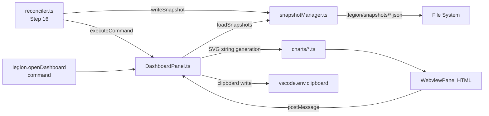

# Feature #10: Analytics Dashboard — Wiki Health Metrics Over Time

> **Legion VS Code Extension** — Feature PRD #010
>
> **Status:** Draft
> **Priority:** P2
> **Effort:** L (8-24h)
> **Schema changes:** None (new `.legion/snapshots/` directory; no database)

---

## Phase Overview

### Goals

After each reconcile pass, Legion computes a `WikiCoverage` object describing the health of the wiki: total entity count, distribution by maturity status (seed/developing/mature/evergreen), distribution by module, ADR count, and contradiction rate. This data is currently computed and discarded — it is never persisted between sessions. As a result, there is no way for an engineering team to see whether their documentation discipline is improving, where the debt is concentrated, or whether a recent project increased the seed entity count.

This PRD defines an analytics dashboard WebviewPanel that renders historical trends as SVG charts, making documentation debt visible at the team level. The dashboard is self-contained: data is persisted locally in `.legion/snapshots/`, charts are rendered as TypeScript-generated SVG strings (no external chart library), and the panel is accessible via a sidebar button and a VS Code command.

### Scope

- New command: `legion.openDashboard` → opens a `WebviewPanel` titled "Legion Analytics".
- Snapshot system: `src/driver/snapshotManager.ts` writes one JSON file per reconcile pass to `.legion/snapshots/`. Max 90 snapshots; oldest pruned automatically.
- Five charts rendered as pure SVG:
  1. Entity count over time (line chart).
  2. Maturity distribution over time (stacked area).
  3. ADR filing rate (monthly grouped bar chart).
  4. Contradiction rate over time (line chart: contradictions/pass).
  5. Coverage by module (horizontal bar chart, latest snapshot).
- "Copy as Markdown table" button per chart.
- "Refresh" button in panel title bar.
- "Dashboard" button in Legion sidebar footer.
- Auto-refresh when `legion.internal.coverageUpdate` fires.

### Out of scope

- External chart library dependencies in the webview (no Chart.js, D3, Vega, etc.).
- Export as PNG or PDF (Markdown table export only in v1).
- Server-side or cloud-hosted analytics (all data is local).
- Team-level aggregation across multiple repositories.
- Real-time streaming updates (panel refreshes on reconcile completion, not per-entity).

### Dependencies

- **Blocks:** None.
- **Blocked by:** None technically; the coverage computation is already present in `reconciler.ts`. This PRD adds persistence and visualization.
- **External:** VS Code WebviewPanel API (stable). No new npm dependencies.

---

## Problem Statement

Engineering teams adopting Legion have no visibility into whether their documentation discipline is improving week over week. The coverage percentage is computed after each reconcile but not retained. Without historical data, documentation reviews are anecdotal ("it feels better") and debt cannot be tracked as a team KPI. Management has no artifact to review. New engineers joining the team cannot see the trajectory.

The data needed for a useful dashboard already exists — it is computed and thrown away 90 times per month per repository.

---

## Goals

1. After running Legion for one week, a team lead can open the dashboard and see entity count and maturity trend lines.
2. A developer can identify which module has the worst documentation coverage from the "Coverage by module" chart.
3. The dashboard panel renders in under 2 seconds for 90 snapshots.
4. Any chart can be exported as a Markdown table for pasting into a team retrospective.
5. The dashboard auto-refreshes after each reconcile pass without user action.

## Non-Goals

- Replacing the existing coverage badge/status bar item (that stays).
- Providing queryable analytics (SQL, HogQL, etc.) over snapshot data.
- Rendering charts in the sidebar (WebviewPanel only).
- CI integration / PR comment with coverage trends.

---

## User Stories

### US-10.1 — Open the analytics dashboard

**As a** developer or team lead, **I want** to open a Legion Analytics panel showing historical trends, **so that** I can see whether our documentation discipline is improving over time.

**Acceptance criteria:**
- AC-10.1.1 Given I run `Legion: Open Dashboard` or click the "Dashboard" button in the Legion sidebar footer, then a WebviewPanel opens titled "Legion Analytics".
- AC-10.1.2 Given `.legion/snapshots/` has 0 files, then the panel shows "No snapshots yet — run Legion to collect data" instead of empty charts.
- AC-10.1.3 Given `.legion/snapshots/` has ≥ 1 file, then all five charts render with data from the available snapshots.
- AC-10.1.4 Given the panel is open and a reconcile pass completes, then the panel auto-refreshes within 5 seconds.

### US-10.2 — View entity count trend

**As a** developer, **I want** to see how total entity count has changed over time, **so that** I can confirm that new features are being documented.

**Acceptance criteria:**
- AC-10.2.1 Given ≥ 2 snapshots exist, then the entity count line chart shows a polyline with date on the x-axis and entity count on the y-axis.
- AC-10.2.2 Given I hover over a data point (not required in v1 — static SVG), then the chart title shows the date range of the current dataset.
- AC-10.2.3 Given entity count decreased between two consecutive snapshots (entity deleted), then the line shows a dip — no data normalization.

### US-10.3 — View maturity distribution trend

**As a** team lead, **I want** to see how the seed/developing/mature/evergreen ratio has changed, **so that** I can quantify documentation quality improvement (not just quantity).

**Acceptance criteria:**
- AC-10.3.1 Given ≥ 2 snapshots exist, then a stacked area chart shows the four maturity bands over time, color-coded: seed=red, developing=amber, mature=blue, evergreen=green.
- AC-10.3.2 Given all entities are in seed status (worst case), then the red band fills the full chart height.
- AC-10.3.3 The chart shows absolute entity counts per band, not percentages (so growth is also visible).

### US-10.4 — Export chart data as Markdown table

**As a** team lead preparing a sprint retrospective, **I want** to copy chart data as a Markdown table, **so that** I can paste it into Notion/Confluence without manual transcription.

**Acceptance criteria:**
- AC-10.4.1 Given I click "Copy as Markdown table" under the entity count chart, then a Markdown table is written to the clipboard with columns `| Date | Total |`.
- AC-10.4.2 Given I click "Copy as Markdown table" under the maturity chart, then the table has columns `| Date | Seed | Developing | Mature | Evergreen |`.
- AC-10.4.3 Given the clipboard write succeeds, then a VS Code `showInformationMessage` shows "Copied to clipboard".

### US-10.5 — View coverage by module

**As a** developer triaging documentation debt, **I want** to see which module has the worst documentation coverage, **so that** I can prioritize my next documentation pass.

**Acceptance criteria:**
- AC-10.5.1 Given the latest snapshot contains per-module coverage data, then a horizontal bar chart shows modules sorted by coverage percentage (lowest first).
- AC-10.5.2 Given a module has 0% mature entities, then its bar is fully red; at 100% it is fully green; intermediate values are amber.
- AC-10.5.3 The chart uses data from the single latest snapshot only (not trends).

---

## Technical Design

### Snapshot data model

#### `src/driver/snapshotManager.ts`

```typescript
export interface Snapshot {
  date: string;                    // ISO-8601 e.g. "2026-04-30T18:00:00.000Z"
  entityCount: number;
  byStatus: {
    seed: number;
    developing: number;
    mature: number;
    evergreen: number;
  };
  byModule: Record<string, ModuleCoverage>;
  adrCount: number;
  contradictionsDetected: number;
  contradictionsResolved: number;
  maturityPct: number;             // 0-100
}

export interface ModuleCoverage {
  total: number;
  mature: number;
  pct: number;                     // mature/total*100, 0-100
}

const SNAPSHOT_DIR = ".legion/snapshots";
const MAX_SNAPSHOTS = 90;

export async function writeSnapshot(
  repoRoot: string,
  data: Omit<Snapshot, "date">
): Promise<void> {
  const dir = path.join(repoRoot, SNAPSHOT_DIR);
  await fs.mkdir(dir, { recursive: true });

  const snapshot: Snapshot = { date: new Date().toISOString(), ...data };
  const filename = `${snapshot.date.replace(/[:.]/g, "-")}.json`;
  await fs.writeFile(
    path.join(dir, filename),
    JSON.stringify(snapshot, null, 2)
  );

  await pruneOld(repoRoot);
}

export async function loadSnapshots(repoRoot: string): Promise<Snapshot[]> {
  const dir = path.join(repoRoot, SNAPSHOT_DIR);
  try {
    const files = (await fs.readdir(dir))
      .filter((f) => f.endsWith(".json"))
      .sort(); // ISO date filenames sort chronologically

    const snapshots: Snapshot[] = [];
    for (const file of files) {
      try {
        const raw = await fs.readFile(path.join(dir, file), "utf8");
        snapshots.push(JSON.parse(raw) as Snapshot);
      } catch { /* skip malformed */ }
    }
    return snapshots;
  } catch {
    return [];
  }
}

export async function pruneOld(repoRoot: string): Promise<void> {
  const dir = path.join(repoRoot, SNAPSHOT_DIR);
  const files = (await fs.readdir(dir))
    .filter((f) => f.endsWith(".json"))
    .sort();

  if (files.length <= MAX_SNAPSHOTS) return;

  const toDelete = files.slice(0, files.length - MAX_SNAPSHOTS);
  await Promise.all(
    toDelete.map((f) => fs.unlink(path.join(dir, f)).catch(() => {}))
  );
}
```

### SVG chart generation

All charts are generated server-side (in the extension process) as SVG strings and injected into the WebviewPanel HTML. This avoids shipping a chart library in the webview bundle.

#### Chart dimensions (constants)

```typescript
const CHART = {
  width: 700,
  height: 300,
  padding: { top: 20, right: 20, bottom: 40, left: 60 },
};
// Inner drawing area
const INNER = {
  w: CHART.width - CHART.padding.left - CHART.padding.right,  // 620
  h: CHART.height - CHART.padding.top - CHART.padding.bottom, // 240
};
```

#### Line chart (`src/dashboard/charts/lineChart.ts`)

```typescript
export function renderLineChart(
  series: { date: string; value: number }[],
  opts: { title: string; yLabel: string; color: string }
): string {
  if (series.length === 0) return emptyChart(opts.title);

  const maxY = Math.max(...series.map((s) => s.value)) * 1.1 || 1;
  const minDate = new Date(series[0].date).getTime();
  const maxDate = new Date(series[series.length - 1].date).getTime();
  const dateRange = maxDate - minDate || 1;

  const toX = (date: string) =>
    CHART.padding.left +
    ((new Date(date).getTime() - minDate) / dateRange) * INNER.w;

  const toY = (value: number) =>
    CHART.padding.top + INNER.h - (value / maxY) * INNER.h;

  const points = series
    .map((s) => `${toX(s.date).toFixed(1)},${toY(s.value).toFixed(1)}`)
    .join(" ");

  const xAxis = renderXAxis(series.map((s) => s.date));
  const yAxis = renderYAxis(maxY, opts.yLabel);

  return `
<svg xmlns="http://www.w3.org/2000/svg" width="${CHART.width}" height="${CHART.height}" role="img">
  <title>${opts.title}</title>
  ${yAxis}
  ${xAxis}
  <polyline
    fill="none"
    stroke="${opts.color}"
    stroke-width="2"
    points="${points}"
  />
  ${series.map((s) => `<circle cx="${toX(s.date).toFixed(1)}" cy="${toY(s.value).toFixed(1)}" r="3" fill="${opts.color}"/>`).join("")}
  <text x="${CHART.width / 2}" y="${CHART.height - 4}" text-anchor="middle" font-size="12" fill="#666">${opts.title}</text>
</svg>`;
}
```

#### Stacked area chart (maturity over time)

```typescript
const MATURITY_COLORS = {
  seed: "#e53935",
  developing: "#f59e0b",
  mature: "#3b82f6",
  evergreen: "#22c55e",
} as const;

export function renderStackedAreaChart(snapshots: Snapshot[]): string {
  // Compute cumulative stacks per snapshot
  // ... (polygon path generation for each band)
  // Returns SVG with four <polygon> elements layered bottom-up
}
```

#### Horizontal bar chart (coverage by module)

```typescript
export function renderModuleCoverageChart(
  byModule: Record<string, ModuleCoverage>
): string {
  const sorted = Object.entries(byModule)
    .sort(([, a], [, b]) => a.pct - b.pct); // lowest first

  const barHeight = 24;
  const gap = 6;
  const totalHeight = sorted.length * (barHeight + gap) + 60;

  // Color: pct=0 → red, pct=50 → amber, pct=100 → green (HSL interpolation)
  const barColor = (pct: number) => {
    const hue = pct * 1.2; // 0=red(0°), 100=green(120°)
    return `hsl(${hue}, 70%, 50%)`;
  };

  // ... render bars as <rect> elements with module labels
}
```

### WebviewPanel wiring (`src/dashboard/dashboardPanel.ts`)

```typescript
import * as vscode from "vscode";
import { loadSnapshots } from "../driver/snapshotManager";
import { renderLineChart } from "./charts/lineChart";
import { renderStackedAreaChart } from "./charts/stackedAreaChart";
import { renderAdrBarChart } from "./charts/adrBarChart";
import { renderContradictionChart } from "./charts/contradictionChart";
import { renderModuleCoverageChart } from "./charts/moduleCoverageChart";
import { buildMarkdownTable } from "./markdownTable";

export class DashboardPanel {
  static currentPanel: DashboardPanel | undefined;
  private readonly _panel: vscode.WebviewPanel;
  private readonly _repoRoot: string;
  private _disposables: vscode.Disposable[] = [];

  static open(repoRoot: string, context: vscode.ExtensionContext): void {
    if (DashboardPanel.currentPanel) {
      DashboardPanel.currentPanel._panel.reveal(vscode.ViewColumn.One);
      return;
    }
    const panel = vscode.window.createWebviewPanel(
      "legionDashboard",
      "Legion Analytics",
      vscode.ViewColumn.One,
      { enableScripts: true, retainContextWhenHidden: true }
    );
    DashboardPanel.currentPanel = new DashboardPanel(panel, repoRoot, context);
  }

  private constructor(
    panel: vscode.WebviewPanel,
    repoRoot: string,
    context: vscode.ExtensionContext
  ) {
    this._panel = panel;
    this._repoRoot = repoRoot;

    this._update();

    this._panel.onDidDispose(() => this.dispose(), null, this._disposables);

    this._panel.webview.onDidReceiveMessage(
      async (message: { command: string; chartId: string }) => {
        if (message.command === "copyTable") {
          const snapshots = await loadSnapshots(this._repoRoot);
          const table = buildMarkdownTable(message.chartId, snapshots);
          await vscode.env.clipboard.writeText(table);
          vscode.window.showInformationMessage("Copied to clipboard");
        }
        if (message.command === "refresh") {
          this._update();
        }
      },
      null,
      this._disposables
    );

    // Auto-refresh on coverage update event
    context.subscriptions.push(
      vscode.commands.registerCommand("legion.internal.dashboardRefresh", () =>
        this._update()
      )
    );
  }

  private async _update(): Promise<void> {
    const snapshots = await loadSnapshots(this._repoRoot);
    this._panel.webview.html = this._buildHtml(snapshots);
  }

  private _buildHtml(snapshots: Snapshot[]): string {
    const entityChart = snapshots.length === 0
      ? "<p class='no-data'>No snapshots yet — run Legion to collect data.</p>"
      : renderLineChart(
          snapshots.map((s) => ({ date: s.date, value: s.entityCount })),
          { title: "Entity Count Over Time", yLabel: "Entities", color: "#3b82f6" }
        );

    const maturityChart = snapshots.length < 2
      ? "<p class='no-data'>Need at least 2 snapshots for trend charts.</p>"
      : renderStackedAreaChart(snapshots);

    const adrChart = renderAdrBarChart(snapshots);
    const contradictionChart = renderContradictionChart(snapshots);
    const moduleChart = snapshots.length === 0
      ? ""
      : renderModuleCoverageChart(snapshots[snapshots.length - 1].byModule);

    return `<!DOCTYPE html>
<html>
<head>
  <meta charset="UTF-8">
  <style>
    body { font-family: var(--vscode-font-family); padding: 16px; }
    h2 { color: var(--vscode-foreground); }
    .chart-section { margin-bottom: 32px; }
    .chart-section h3 { font-size: 14px; margin-bottom: 8px; }
    .copy-btn { font-size: 12px; padding: 4px 8px; cursor: pointer; margin-top: 4px;
                background: var(--vscode-button-secondaryBackground);
                color: var(--vscode-button-secondaryForeground); border: none; }
    .no-data { color: var(--vscode-descriptionForeground); font-style: italic; }
    svg text { font-family: var(--vscode-font-family); }
  </style>
</head>
<body>
  <h2>Legion Analytics Dashboard</h2>
  <p>Snapshots: ${snapshots.length} (max 90). Last: ${
    snapshots.length ? snapshots[snapshots.length - 1].date.slice(0, 10) : "none"
  } <button onclick="refresh()">↻ Refresh</button></p>

  <div class="chart-section">
    <h3>Entity Count Over Time</h3>
    ${entityChart}
    <button class="copy-btn" onclick="copyTable('entity-count')">Copy as Markdown table</button>
  </div>

  <div class="chart-section">
    <h3>Maturity Distribution Over Time</h3>
    ${maturityChart}
    <button class="copy-btn" onclick="copyTable('maturity')">Copy as Markdown table</button>
  </div>

  <div class="chart-section">
    <h3>ADR Filing Rate (Monthly)</h3>
    ${adrChart}
    <button class="copy-btn" onclick="copyTable('adr-rate')">Copy as Markdown table</button>
  </div>

  <div class="chart-section">
    <h3>Contradiction Rate Over Time</h3>
    ${contradictionChart}
    <button class="copy-btn" onclick="copyTable('contradiction-rate')">Copy as Markdown table</button>
  </div>

  ${moduleChart ? `
  <div class="chart-section">
    <h3>Coverage by Module (Latest Snapshot)</h3>
    ${moduleChart}
  </div>` : ""}

  <script>
    const vscode = acquireVsCodeApi();
    function copyTable(chartId) {
      vscode.postMessage({ command: 'copyTable', chartId });
    }
    function refresh() {
      vscode.postMessage({ command: 'refresh' });
    }
  </script>
</body>
</html>`;
  }

  dispose(): void {
    DashboardPanel.currentPanel = undefined;
    this._panel.dispose();
    this._disposables.forEach((d) => d.dispose());
    this._disposables = [];
  }
}
```

### Reconciler integration

After Step 14 (coverage update), Step 15 (Claude context injection), add Step 16:

```typescript
// Step 16 — Persist snapshot
await writeSnapshot(repoRoot, {
  entityCount: coverage.total,
  byStatus: coverage.byStatus,
  byModule: coverage.byModule,
  adrCount: coverage.adrCount,
  contradictionsDetected: coverage.contradictionsDetected ?? 0,
  contradictionsResolved: coverage.contradictionsResolved ?? 0,
  maturityPct: coverage.maturityPct,
});

// Notify open dashboard panel
vscode.commands.executeCommand("legion.internal.dashboardRefresh");
```

### Architecture overview



---

## Implementation Plan

### Phase 1 — Snapshot manager (Day 1, ~2h)

1. Create `src/driver/snapshotManager.ts` with `writeSnapshot()`, `loadSnapshots()`, `pruneOld()`.
2. Define `Snapshot` and `ModuleCoverage` interfaces.
3. Unit tests: write/load/prune round-trip; prune enforces max 90; malformed JSON files skipped.
4. Wire `writeSnapshot()` into `reconciler.ts` Step 16.

### Phase 2 — SVG chart functions (Days 1-2, ~6h)

1. Create `src/dashboard/charts/lineChart.ts` with `renderLineChart()`.
2. Create `src/dashboard/charts/stackedAreaChart.ts` with `renderStackedAreaChart()`.
3. Create `src/dashboard/charts/adrBarChart.ts` with `renderAdrBarChart()`.
4. Create `src/dashboard/charts/contradictionChart.ts`.
5. Create `src/dashboard/charts/moduleCoverageChart.ts`.
6. Create `src/dashboard/markdownTable.ts` with `buildMarkdownTable()`.
7. Unit tests for each chart function: 0 snapshots, 1 snapshot, 90 snapshots, all-zero values.

### Phase 3 — WebviewPanel and command (Day 2–3, ~4h)

1. Create `src/dashboard/dashboardPanel.ts` with `DashboardPanel` class.
2. Register `legion.openDashboard` command in `extension.ts`.
3. Add `legion.internal.dashboardRefresh` internal command.
4. Wire auto-refresh: `vscode.commands.executeCommand("legion.internal.dashboardRefresh")` at end of reconcile.
5. Add "Dashboard" button to Legion sidebar footer (`src/views/LegionTreeProvider.ts`).
6. Integration test: open panel with 5 mocked snapshots, verify HTML contains SVG elements.

### Phase 4 — Polish and edge cases (Day 3, ~2h)

1. Handle 0-snapshot empty state in all five chart positions.
2. Handle 1-snapshot state (module chart renders; trend charts show "need ≥ 2").
3. CSP (Content Security Policy) header for webview: `default-src 'none'; style-src 'unsafe-inline'; script-src 'nonce-...'`.
4. Test "Copy as Markdown table" clipboard write for all chart IDs.
5. Add snapshot directory to `.gitignore` recommendation in Initialize summary.

---

## Data Model Changes

No schema changes. New directory tree:

```
.legion/
└── snapshots/
    ├── 2026-04-30T18-00-00-000Z.json
    ├── 2026-04-30T20-00-00-000Z.json
    └── ...  (max 90 files)
```

---

## Files Touched

### New files
- `src/driver/snapshotManager.ts` — write, load, prune
- `src/driver/snapshotManager.spec.ts` — unit tests
- `src/dashboard/dashboardPanel.ts` — WebviewPanel class
- `src/dashboard/markdownTable.ts` — clipboard table builder
- `src/dashboard/charts/lineChart.ts`
- `src/dashboard/charts/stackedAreaChart.ts`
- `src/dashboard/charts/adrBarChart.ts`
- `src/dashboard/charts/contradictionChart.ts`
- `src/dashboard/charts/moduleCoverageChart.ts`
- `src/dashboard/charts/*.spec.ts` (one per chart)

### Modified files
- `src/reconciler.ts` — Step 16 (snapshot write + dashboard refresh)
- `src/extension.ts` — register `legion.openDashboard` command
- `src/views/LegionTreeProvider.ts` — "Dashboard" footer button
- `package.json` — register `legion.openDashboard` command

---

## Success Metrics

| Metric | Target |
|---|---|
| Dashboard open time (90 snapshots) | < 2 seconds |
| SVG rendering time for all 5 charts (90 snapshots) | < 500ms |
| Snapshot write overhead per reconcile pass | < 50ms |
| "Copy as Markdown table" clipboard write latency | < 100ms |
| Prune operation time for 91st snapshot | < 100ms |
| Webview Content Security Policy violations | 0 |

---

## Open Questions

1. **Snapshot directory in `.gitignore`?** Snapshots are machine-local analytics data. They should probably be gitignored by default. But if a team wants to share historical data across developers, committing the snapshots is valid. Add as a configuration option?
2. **Snapshot granularity:** one snapshot per reconcile pass could produce many snapshots per hour if the user runs Legion frequently. Should we deduplicate by date (one per calendar day) or limit to one per hour?
3. **Module definition:** `byModule` assumes the codebase has a clear module structure (e.g. `src/driver/`, `src/views/`). How is "module" determined from the reconciler? Document this convention.
4. **WebviewPanel persistence:** `retainContextWhenHidden: true` keeps the webview alive when the panel is hidden. This increases memory usage. Should we instead rebuild the HTML on each panel reveal?

---

## Risks and Open Questions

- **Risk:** SVG generation is incorrect for edge cases (all-zero data, single data point, negative values). **Mitigation:** Unit tests with degenerate inputs for every chart function. Add explicit guards: `if (series.length === 0) return emptyChart()`.
- **Risk:** Webview CSP violations cause blank panel. **Mitigation:** All styles are inline (no external CSS); all scripts are the single `acquireVsCodeApi()` block with a per-render nonce. Test with VS Code's webview CSP debug mode enabled.
- **Risk:** `.legion/snapshots/` grows beyond 90 files if `pruneOld` fails silently. **Mitigation:** `pruneOld` is called synchronously in `writeSnapshot`; failures are logged to the Legion output channel but do not block the reconcile pass.

---

## Related

- [`feature-007-claude-code-integration/prd-feature-007-claude-code-integration.md`](../feature-007-claude-code-integration/prd-feature-007-claude-code-integration.md) — also adds a Step 15 to reconciler; Step 16 (this PRD) must be ordered after it.
- [`knowledge-base/architecture/reconciler-pipeline.md`](../../../knowledge-base/architecture/reconciler-pipeline.md) — canonical step-by-step description of the reconciler pipeline; Step 16 must be documented there after ship.
