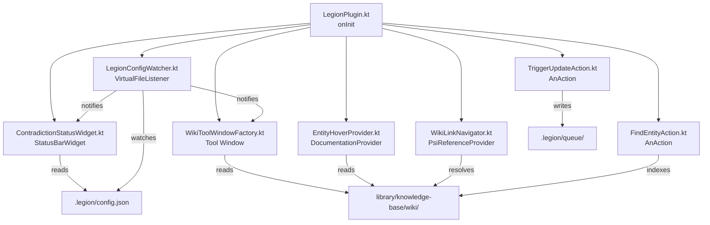

# Feature #11: JetBrains Plugin — Read-only Legion Wiki Integration for IntelliJ and WebStorm

> **Legion VS Code Extension** — Feature PRD #011
>
> **Status:** Draft
> **Priority:** P3
> **Effort:** L (8-24h)
> **Schema changes:** None (separate project; reads existing Legion file protocol)

---

## Phase Overview

### Goals

Many engineering teams use JetBrains IDEs (IntelliJ IDEA, WebStorm, PyCharm) alongside VS Code — often different developers on the same team prefer different editors, or the same developer switches IDEs by task type. Legion's wiki is stored as plain Markdown files in a standard format that any tool can read. But JetBrains users currently have no IDE-integrated access to the wiki: no entity hover docs, no wikilink navigation, no Find Entity action, and no visibility into the contradiction inbox.

This PRD defines a JetBrains plugin (separate project, separate distribution) that reads the Legion wiki without duplicating any agent logic. Version 1 is deliberately read-only: Document/Update/Lint operations remain in the VS Code extension. The JetBrains plugin is a wiki consumer, not a producer — a documentation portal for developers who prefer JetBrains tooling.

### Scope

- Separate IntelliJ Platform Plugin project in Kotlin, targeting IntelliJ Platform 2024.1+.
- **Wiki Tree Tool Window:** panel showing wiki pages organized by type folder; clicking opens the page in JetBrains' Markdown editor.
- **Entity hover documentation:** hover over a function/class name → look up matching wiki entity → show frontmatter + Overview section as a popup.
- **Wikilink navigation:** Go To Declaration / Ctrl+Click on `[[pageName]]` in Markdown files opens the referenced wiki page.
- **Find Entity action:** searchable action (double-Shift) for fuzzy wiki page search; click navigates to the page or to the `file:line` reference.
- **Contradiction badge:** status bar widget showing unresolved contradiction count from `.legion/config.json`.
- **Trigger Update bridge:** "Legion: Trigger Update" action drops a queue marker in `.legion/queue/` (same format as feature-008).
- **Distribution:** JetBrains Plugin Marketplace; open source.
- **Build:** Kotlin Gradle with `org.jetbrains.intellij` plugin; GitHub Actions CI.

### Out of scope

- Wiki-guardian agent execution inside JetBrains (prompts, LLM calls — VS Code only in v1).
- Writing to wiki entity files (read-only in v1 except for queue marker files).
- Human annotations (feature-008 / Obsidian only in v1; add to JetBrains in v2).
- WebStorm-specific UI components (the plugin targets the IntelliJ Platform SDK and works in all IntelliJ-family IDEs).
- Windows ARM support (standard IntelliJ Platform constraint; add when IntelliJ adds official support).

### Dependencies

- **Blocks:** None.
- **Blocked by:** The target project must have Legion initialized (`.legion/config.json` must exist, `library/knowledge-base/wiki/` must be populated).
- **Blocked by (cross-feature):** feature-008 defines the `.legion/queue/` marker file format; this PRD reuses that format without modification.
- **External:** IntelliJ Platform SDK 2024.1+; Kotlin 1.9+; Gradle 8+; JetBrains Marketplace publishing token.

---

## Problem Statement

JetBrains IDE users on a Legion-enabled team have zero IDE integration with the wiki. They must switch to VS Code to use the sidebar, or open wiki pages manually in their file manager. Entity hover documentation — a feature that makes wiki content ambient and discoverable — is impossible without IDE integration. The contradiction inbox is invisible to JetBrains users. The result is a two-tier team: VS Code users get full Legion integration, JetBrains users get none.

The file protocol Legion uses is simple and stable: `.legion/config.json`, `library/knowledge-base/wiki/`, `.legion/queue/`. A JetBrains plugin can implement the full read path without touching the VS Code codebase.

---

## Goals

1. A developer opening a Legion-enabled project in WebStorm sees the Legion Wiki panel in the tool window bar.
2. Hovering over a class or function name that has a matching wiki entity shows the entity's frontmatter and Overview section as an IDE documentation popup.
3. `[[wikilinks]]` in Markdown files are navigable with Ctrl+Click / Cmd+Click.
4. The contradiction count is visible in the status bar at all times.
5. Any JetBrains user can trigger a Legion update pass by running the "Legion: Trigger Update" action.

## Non-Goals

- Running wiki-guardian or any Legion agent logic inside JetBrains.
- A two-way sync channel between JetBrains and VS Code.
- Authoring new wiki entity pages from JetBrains.
- Mobile IDE support (IntelliJ platform desktop only).

---

## User Stories

### US-11.1 — Browse wiki in the JetBrains tool window

**As a** WebStorm user on a Legion-enabled team, **I want** to browse the Legion wiki in a tool window panel, **so that** I can navigate entity pages without leaving my IDE.

**Acceptance criteria:**
- AC-11.1.1 Given Legion is initialized in the project root, when I open the project in IntelliJ/WebStorm, then a "Legion Wiki" tool window appears in the tool window bar (right side by default).
- AC-11.1.2 Given the tool window is open, then it shows a tree of wiki pages organized by subfolder: `entities/`, `concepts/`, `adrs/`, `questions/`, and any custom subfolders.
- AC-11.1.3 Given I double-click a page in the tree, then it opens in JetBrains' built-in Markdown preview/editor panel.
- AC-11.1.4 Given `.legion/config.json` does not exist, then the tool window shows "Legion not initialized" with a link to the marketplace page.
- AC-11.1.5 Given the wiki folder is updated on disk (new entity added), then the tree refreshes within 5 seconds (file system watch).

### US-11.2 — Entity hover documentation

**As a** developer reading TypeScript code in WebStorm, **I want** to see Legion entity documentation when hovering over a class or function name, **so that** architectural context is surfaced inline without context-switching.

**Acceptance criteria:**
- AC-11.2.1 Given I hover over a symbol (class, function, interface) in a TypeScript/JavaScript file, and `library/knowledge-base/wiki/entities/<SymbolName>.md` exists (case-insensitive match), then a documentation popup appears showing the entity's frontmatter fields and the content of the `## Overview` section.
- AC-11.2.2 Given no matching wiki entity exists for the hovered symbol, then no Legion popup appears (standard JetBrains behavior only).
- AC-11.2.3 Given the matching entity file exists but has no `## Overview` section, then the popup shows frontmatter only with a note "No Overview section in wiki entity."
- AC-11.2.4 The popup appears within 500ms of hover start. Entity file reads are cached in memory for 60 seconds.

### US-11.3 — Wikilink navigation

**As a** developer editing Markdown files in IntelliJ, **I want** `[[pageName]]` wikilinks to be navigable with Ctrl+Click, **so that** I can traverse the wiki graph from within my editor.

**Acceptance criteria:**
- AC-11.3.1 Given I have a `.md` file open containing `[[ReconcilerService]]`, when I Ctrl+Click (or Cmd+Click on Mac) the link, then the IDE navigates to `library/knowledge-base/wiki/entities/ReconcilerService.md` (or whichever subfolder it is found in, searched across all wiki subfolders).
- AC-11.3.2 Given the referenced page does not exist, when I Ctrl+Click, then a "No target found" notice is shown (standard IDE behavior for unresolvable references).
- AC-11.3.3 Given the file is found, then the navigation is registered in the IDE's navigation history (back/forward buttons work).

### US-11.4 — Find Entity action

**As a** developer, **I want** to fuzzy-search wiki entities from the double-Shift "Search Everywhere" dialog or a dedicated "Find Legion Entity" action, **so that** I can jump to any entity in the wiki without knowing its exact name.

**Acceptance criteria:**
- AC-11.4.1 Given I run "Find Legion Entity" from the action search (double-Shift → "Find Legion Entity"), then a popup appears with all wiki entity page names.
- AC-11.4.2 Given I type "recon", then the list filters to pages matching "recon" (fuzzy, case-insensitive).
- AC-11.4.3 Given I select "ReconcilerService", then the IDE opens `library/knowledge-base/wiki/entities/ReconcilerService.md`.
- AC-11.4.4 Given the entity file has a `file:` frontmatter field, then a secondary action "Go to source" in the result popup navigates to the source file at the specified line.

### US-11.5 — Contradiction badge in status bar

**As a** developer, **I want** to see the contradiction count in the JetBrains status bar, **so that** I am aware of documentation conflicts without opening the wiki.

**Acceptance criteria:**
- AC-11.5.1 Given `.legion/config.json` is readable and contains contradictions, then the status bar shows "Legion: ⚠ <N> contradictions" in amber when N > 0.
- AC-11.5.2 Given N = 0 contradictions, then the status bar shows "Legion: ✓" in green.
- AC-11.5.3 Given I click the status bar widget, then a balloon popup lists each unresolved contradiction's description (first 80 chars) with a "Open in editor" link per item.
- AC-11.5.4 Given `.legion/config.json` changes on disk, then the status bar updates within 2 seconds.

### US-11.6 — Trigger Legion update from JetBrains

**As a** JetBrains user who has made changes that should trigger a wiki update, **I want** to request a Legion scan without switching to VS Code, **so that** the wiki reflects my changes promptly.

**Acceptance criteria:**
- AC-11.6.1 Given I run "Legion: Trigger Update" from the action search or the Legion Wiki tool window toolbar, then a file is created at `.legion/queue/<ISO-timestamp>-scan-needed.json` with `{"source":"jetbrains","triggeredAt":"<ISO>"}`.
- AC-11.6.2 Given VS Code with the Legion extension is running and watching the queue, then it picks up the marker and runs a reconcile pass.
- AC-11.6.3 Given the queue directory does not exist, then it is created before writing the marker file.

---

## Technical Design

### Plugin architecture



### `build.gradle.kts` (key sections)

```kotlin
plugins {
    id("org.jetbrains.intellij") version "1.17.3"
    kotlin("jvm") version "1.9.23"
}

intellij {
    version.set("2024.1")
    type.set("IC")  // IntelliJ Community; works in IC, IU, WS, PC, PY
    plugins.set(listOf("markdown"))  // for Markdown file type recognition
}

tasks {
    patchPluginXml {
        sinceBuild.set("241")      // 2024.1
        untilBuild.set("251.*")    // 2025.1
    }
    signPlugin {
        certificateChain.set(System.getenv("CERTIFICATE_CHAIN"))
        privateKey.set(System.getenv("PRIVATE_KEY"))
        password.set(System.getenv("PRIVATE_KEY_PASSWORD"))
    }
    publishPlugin {
        token.set(System.getenv("PUBLISH_TOKEN"))
    }
}
```

### `plugin.xml` (key declarations)

```xml
<idea-plugin>
  <id>com.legion-project.legion</id>
  <name>Legion Wiki</name>
  <vendor>Legion Project</vendor>
  <description>Read-only Legion wiki integration for IntelliJ Platform IDEs.</description>
  <depends>com.intellij.modules.platform</depends>
  <depends>org.intellij.plugins.markdown</depends>

  <extensions defaultExtensionNs="com.intellij">
    <toolWindow id="Legion Wiki"
                anchor="right"
                factoryClass="com.legion.LegionToolWindowFactory"
                icon="/icons/legion.svg"/>

    <statusBarWidgetFactory id="com.legion.ContradictionWidget"
                            implementation="com.legion.ContradictionStatusWidgetFactory"/>

    <documentationProvider
                implementation="com.legion.EntityHoverProvider"
                language="TypeScript"/>
    <documentationProvider
                implementation="com.legion.EntityHoverProvider"
                language="JavaScript"/>

    <psiReferenceContributor
                implementation="com.legion.WikiLinkReferenceContributor"
                language="Markdown"/>
  </extensions>

  <actions>
    <action id="com.legion.FindEntity"
            class="com.legion.FindEntityAction"
            text="Find Legion Entity"
            description="Search all Legion wiki entities">
      <add-to-group group-id="SearchEverywhereGroup" anchor="last"/>
      <keyboard-shortcut keymap="$default" first-keystroke="ctrl shift L"/>
    </action>
    <action id="com.legion.TriggerUpdate"
            class="com.legion.TriggerUpdateAction"
            text="Legion: Trigger Update"
            description="Queue a Legion wiki update pass"/>
  </actions>
</idea-plugin>
```

### Entity hover provider (`EntityHoverProvider.kt`)

```kotlin
class EntityHoverProvider : DocumentationProvider {

    private val cache = ConcurrentHashMap<String, Pair<Long, String?>>()
    private val cacheTtlMs = 60_000L

    override fun generateDoc(element: PsiElement, originalElement: PsiElement?): String? {
        val symbolName = when (element) {
            is TypeScriptClass, is TypeScriptFunction, is TypeScriptInterface ->
                element.name ?: return null
            else -> return null
        }

        val project = element.project
        val wikiRoot = findWikiRoot(project) ?: return null
        val entityContent = readEntityCached(wikiRoot, symbolName) ?: return null

        return buildDocHtml(symbolName, entityContent)
    }

    private fun readEntityCached(wikiRoot: VirtualFile, name: String): String? {
        val now = System.currentTimeMillis()
        val cached = cache[name]
        if (cached != null && now - cached.first < cacheTtlMs) return cached.second

        val entityFile = findEntityFile(wikiRoot, name)
        val content = entityFile?.let {
            VfsUtilCore.loadText(it)
        }
        cache[name] = Pair(now, content)
        return content
    }

    private fun findEntityFile(wikiRoot: VirtualFile, name: String): VirtualFile? {
        val entitiesDir = wikiRoot.findChild("entities") ?: return null
        return entitiesDir.children.firstOrNull {
            it.nameWithoutExtension.equals(name, ignoreCase = true) &&
            it.extension == "md"
        }
    }

    private fun buildDocHtml(name: String, content: String): String {
        val frontmatter = parseFrontmatter(content)
        val overview = extractSection(content, "Overview")

        return buildString {
            append("<html><body>")
            append("<b>Legion Wiki: $name</b><br/>")
            if (frontmatter.isNotEmpty()) {
                append("<code>")
                frontmatter.forEach { (k, v) -> append("$k: $v<br/>") }
                append("</code><hr/>")
            }
            if (overview != null) {
                append(overview.trim())
            } else {
                append("<i>No Overview section in wiki entity.</i>")
            }
            append("</body></html>")
        }
    }
}
```

### Wikilink reference provider (`WikiLinkReferenceContributor.kt`)

```kotlin
class WikiLinkReferenceContributor : PsiReferenceContributor() {
    override fun registerReferenceProviders(registrar: PsiReferenceRegistrar) {
        registrar.registerReferenceProvider(
            PlatformPatterns.psiElement(MarkdownTokenTypes.TEXT)
                .inFile(PlatformPatterns.psiFile(MarkdownFileType.INSTANCE)),
            WikiLinkReferenceProvider()
        )
    }
}

class WikiLinkReferenceProvider : PsiReferenceProvider() {
    private val wikilinkPattern = Regex("""\[\[([^\]]+)]]""")

    override fun getReferencesByElement(
        element: PsiElement,
        context: ProcessingContext
    ): Array<PsiReference> {
        val text = element.text
        return wikilinkPattern.findAll(text).map { match ->
            val pageName = match.groupValues[1]
            val rangeInElement = TextRange(
                match.range.first + 2,
                match.range.last - 1
            )
            WikiLinkReference(element, pageName, rangeInElement)
        }.toList().toTypedArray()
    }
}

class WikiLinkReference(
    element: PsiElement,
    private val pageName: String,
    range: TextRange
) : PsiReferenceBase<PsiElement>(element, range) {

    override fun resolve(): PsiElement? {
        val project = element.project
        val wikiRoot = findWikiRoot(project) ?: return null

        // Search all subfolders for a matching .md file
        val targetFile = VfsUtilCore.iterateChildrenRecursively(
            wikiRoot,
            { dir -> true },
            { file ->
                file.nameWithoutExtension.equals(pageName, ignoreCase = true) &&
                file.extension == "md"
            }
        )

        return targetFile?.let {
            PsiManager.getInstance(project).findFile(it)
        }
    }
}
```

### Contradiction status widget (`ContradictionStatusWidget.kt`)

```kotlin
class ContradictionStatusWidget(private val project: Project) :
    StatusBarWidget, StatusBarWidget.TextPresentation {

    private var unresolvedCount = 0
    private var tooltipText = ""

    override fun ID(): String = "com.legion.ContradictionWidget"
    override fun getPresentation(): StatusBarWidget.WidgetPresentation = this
    override fun getText(): String = if (unresolvedCount > 0)
        "Legion: ⚠ $unresolvedCount" else "Legion: ✓"
    override fun getTooltipText(): String = tooltipText
    override fun getIcon(): Icon? = null

    fun refresh(config: LegionConfig) {
        val unresolved = config.contradictions.filter { !it.resolved }
        unresolvedCount = unresolved.size
        tooltipText = if (unresolved.isEmpty()) "Legion: No contradictions"
        else unresolved.take(5).joinToString("\n") {
            it.description.take(80)
        }
    }

    override fun install(statusBar: StatusBar) {
        // Wire file watcher for .legion/config.json
    }

    override fun dispose() {}
}
```

### Queue file writer (shared utility)

```kotlin
object LegionQueueWriter {
    fun triggerUpdate(project: Project, source: String = "jetbrains") {
        val baseDir = project.basePath ?: return
        val queueDir = File(baseDir, ".legion/queue")
        queueDir.mkdirs()

        val timestamp = Instant.now().toString().replace(":", "-").replace(".", "-")
        val markerFile = File(queueDir, "$timestamp-scan-needed.json")
        markerFile.writeText(
            """{"source":"$source","triggeredAt":"${Instant.now()}"}"""
        )

        Notifications.Bus.notify(
            Notification(
                "Legion",
                "Legion: Update Queued",
                "VS Code will pick up the request on next activation.",
                NotificationType.INFORMATION
            ),
            project
        )
    }
}
```

### Wiki index for Find Entity

Built once on startup and on file system changes; stored in project-level state:

```kotlin
data class WikiPageIndex(
    val name: String,             // page name without extension
    val path: String,             // relative path from wiki root
    val type: String,             // "entity" | "concept" | "adr" | "question"
    val sourceFile: String?,      // from frontmatter "file:" field
    val sourceLine: Int?          // from frontmatter "line:" field
)

class LegionWikiIndex(private val project: Project) {
    private var pages: List<WikiPageIndex> = emptyList()

    fun build() {
        val wikiRoot = findWikiRoot(project) ?: return
        pages = buildList {
            VfsUtilCore.iterateChildrenRecursively(wikiRoot, null) { file ->
                if (file.extension != "md") return@iterateChildrenRecursively true
                val type = file.parent?.name?.let {
                    when (it) {
                        "entities" -> "entity"
                        "concepts" -> "concept"
                        "adrs" -> "adr"
                        "questions" -> "question"
                        else -> "other"
                    }
                } ?: "other"
                val content = VfsUtilCore.loadText(file)
                val frontmatter = parseFrontmatter(content)
                add(
                    WikiPageIndex(
                        name = file.nameWithoutExtension,
                        path = VfsUtilCore.getRelativePath(file, wikiRoot, '/') ?: file.path,
                        type = type,
                        sourceFile = frontmatter["file"],
                        sourceLine = frontmatter["line"]?.toIntOrNull()
                    )
                )
                true
            }
        }
    }

    fun search(query: String): List<WikiPageIndex> =
        pages.filter { it.name.contains(query, ignoreCase = true) }
            .sortedBy { it.name.length }
}
```

---

## Implementation Plan

### Phase 1 — Project scaffold and Wiki Tree Tool Window (Week 1, ~6h)

1. Create `legion-jetbrains` repo from IntelliJ Platform Plugin template.
2. Configure `build.gradle.kts`, `plugin.xml`, GitHub Actions CI (lint + test on push, publish on tag).
3. Implement `LegionToolWindowFactory.kt` with `WikiTreePanel` (file tree using `SimpleTreeModel`).
4. Implement `LegionConfigWatcher.kt` (watch `.legion/config.json` for changes).
5. Implement `findWikiRoot()` utility.
6. Manual QA: open test project in IntelliJ 2024.1, verify tool window renders wiki tree.

### Phase 2 — Entity hover and wikilink navigation (Week 1–2, ~6h)

1. Implement `EntityHoverProvider.kt` with `parseFrontmatter()` and `extractSection()` helpers.
2. Register provider for TypeScript and JavaScript in `plugin.xml`.
3. Implement `WikiLinkReferenceContributor.kt` and `WikiLinkReference.kt`.
4. Implement `LegionWikiIndex.kt` built on project open and on file change.
5. Test hover on a real wiki entity; test Ctrl+Click on `[[EntityName]]` in Markdown.

### Phase 3 — Find Entity, contradiction badge, Trigger Update (Week 2, ~4h)

1. Implement `FindEntityAction.kt` using `ChooseByNamePopup` or `SearchEverywhere` contributor.
2. Implement `ContradictionStatusWidget.kt` + `ContradictionStatusWidgetFactory.kt`.
3. Implement `TriggerUpdateAction.kt` using `LegionQueueWriter`.
4. Wire `LegionConfigWatcher` to update contradiction widget on config change.
5. Integration test: create test project with 3 contradictions, verify status bar count.

### Phase 4 — Distribution (Week 3, ~2h)

1. Generate plugin signing certificate for JetBrains Marketplace submission.
2. Configure `publishPlugin` task with GitHub Actions secret `PUBLISH_TOKEN`.
3. Submit plugin to JetBrains Marketplace (review takes ~1-2 weeks).
4. Write `README.md` documenting all features, requirements, and known limitations.
5. Set up BRAT-compatible beta distribution via GitHub releases for pre-submission testing.

---

## Data Model Changes

None. The plugin reads the file protocol defined by the VS Code extension:

| File | Access | Purpose |
|---|---|---|
| `.legion/config.json` | Read | Status, contradiction inbox |
| `library/knowledge-base/wiki/**/*.md` | Read | Entity browsing, hover docs, wikilink resolution |
| `.legion/queue/<timestamp>-scan-needed.json` | Write | Trigger update marker |

---

## Files Touched (in `legion-jetbrains` repo)

### New files (all in separate repo)
- `src/main/kotlin/com/legion/LegionPlugin.kt` — plugin entry point
- `src/main/kotlin/com/legion/LegionToolWindowFactory.kt` — tool window
- `src/main/kotlin/com/legion/EntityHoverProvider.kt` — hover documentation
- `src/main/kotlin/com/legion/WikiLinkReferenceContributor.kt` — Ctrl+Click navigation
- `src/main/kotlin/com/legion/FindEntityAction.kt` — search action
- `src/main/kotlin/com/legion/ContradictionStatusWidget.kt` — status bar
- `src/main/kotlin/com/legion/ContradictionStatusWidgetFactory.kt`
- `src/main/kotlin/com/legion/TriggerUpdateAction.kt` — queue writer action
- `src/main/kotlin/com/legion/LegionConfigWatcher.kt` — file system watcher
- `src/main/kotlin/com/legion/LegionWikiIndex.kt` — search index
- `src/main/kotlin/com/legion/utils/FrontmatterParser.kt`
- `src/main/kotlin/com/legion/utils/SectionExtractor.kt`
- `src/main/kotlin/com/legion/utils/WikiRootFinder.kt`
- `src/main/resources/META-INF/plugin.xml`
- `src/main/resources/icons/legion.svg`
- `build.gradle.kts`
- `.github/workflows/ci.yml`
- `.github/workflows/publish.yml`
- `README.md`

### Modified files (in main Legion extension repo)
- `.cursor/skills/wiki-weapon/` — document queue marker file format (already shared with feature-008)

---

## Success Metrics

| Metric | Target |
|---|---|
| Tool window render time on project open | < 1 second |
| Entity hover popup display latency | < 500ms (with 60s cache) |
| Wikilink Ctrl+Click navigation latency | < 200ms |
| Find Entity search with 500 entities | < 100ms for fuzzy filter |
| Status bar contradiction count update latency | < 2 seconds after config change |
| Plugin install size on JetBrains Marketplace | < 500KB |
| Compatible IDE versions | IntelliJ 2024.1 through 2025.1 |

---

## Open Questions

1. **TypeScript plugin availability:** `EntityHoverProvider` targets TypeScript/JavaScript elements. IntelliJ Community edition does not bundle the TypeScript plugin — only WebStorm and IntelliJ Ultimate do. Should we gracefully degrade (hover provider silently inactive) or declare `com.intellij.modules.webstorm` as a dependency (limiting to WebStorm/Ultimate only)?
2. **Wiki root detection:** `findWikiRoot()` searches for `library/knowledge-base/wiki/` from the project base directory. What if the project has a non-standard wiki path (set in `legion.wikiPath`)? Should the plugin read `.legion/config.json` to determine the wiki path dynamically?
3. **Index staleness:** `LegionWikiIndex` is built in memory. On a project with 2,000 wiki pages, how large is the index? Is memory pressure acceptable? Consider persisting the index to `.legion/jetbrains-index.json` between sessions.
4. **Paired versioning:** when the `.legion/config.json` schema changes (VS Code extension update), the JetBrains plugin may break silently. Define a `schemaVersion` field in config.json and a graceful degradation path when schema version is unrecognized.

---

## Risks and Open Questions

- **Risk:** JetBrains Marketplace review rejects the plugin for security concerns (writing queue files). **Mitigation:** document clearly in the plugin description that the queue file write is scoped to `.legion/queue/` within the project directory; provide source code link for review.
- **Risk:** IntelliJ Platform API changes break the plugin on 2025.x IDEs. **Mitigation:** CI matrix tests against 2024.1, 2024.2, 2024.3, 2025.1 using the `runPluginVerifier` Gradle task. Pin `untilBuild` conservatively and republish on each major IntelliJ release.
- **Risk:** Hover provider causes performance regression (blocks UI thread). **Mitigation:** Enforce that `generateDoc()` only does in-memory cache lookups on the EDT; all file I/O is done on a background thread with the result posted back. Use `ReadAction.compute` for VFS access.
- **Risk:** Plugin works in IntelliJ but not in WebStorm due to different bundled plugin set. **Mitigation:** Test in WebStorm 2024.1 specifically during Phase 2 QA; use `com.intellij.modules.platform` (not `com.intellij.modules.lang`) as the only hard dependency.

---

## Related

- [`feature-008-obsidian-companion-plugin/prd-feature-008-obsidian-companion-plugin.md`](../feature-008-obsidian-companion-plugin/prd-feature-008-obsidian-companion-plugin.md) — shares the `.legion/queue/` trigger-update file protocol.
- [`feature-007-claude-code-integration/prd-feature-007-claude-code-integration.md`](../feature-007-claude-code-integration/prd-feature-007-claude-code-integration.md) — parallel third-party tool integration pattern; compare Layer 1 (file-protocol) with this PRD's approach.
- [`knowledge-base/architecture/legion-file-protocol.md`](../../../knowledge-base/architecture/legion-file-protocol.md) — canonical definition of `.legion/config.json`, `.legion/queue/`, and `library/knowledge-base/wiki/` formats; this PRD consumes all three.
